# SVM_支持向量机
 
* [损失函数_成本函数_模型函数](#损失函数_成本函数_模型函数)
* [理解支持向量机](#理解支持向量机)
* [为什么会产生大间距](#为什么会产生大间距)
  * [向量点积](#向量点积)
  * [SVM的决策](#SVM的决策)

*本节课为后续补充，当年没有SVM部分，本课程为往年录制，习惯上有一些差异，如本该是对于每一个样本的损失函数(loss)也称为成本(cost)，z=wx+b写为了和系数矩阵θ相关的项*

## 损失函数_成本函数_模型函数

在学习更为复杂的非线性方程时，更加强大

这是我们在逻辑回归时的模型，`h/f(x)`是一个segma函数，它作用于`z=wx+b`

当真实的`y`等于1时，我们希望`f(x)`趋近于1，那么z就要趋近正无穷

这是逻辑回归一个样本的**损失函数**

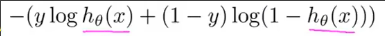

当`y=1`时，损失函数即为

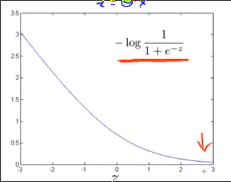

而支持向量机的损失函数在`y=1`时长这样

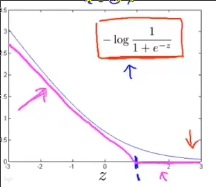

在`z=1`时发生转折 `loss_1(z)`

而`y=0`的时候，支持向量机损失函数在`z=-1`时发生转折 `loss_0(z)`

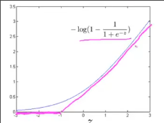

因此我们可以类比写出**支持向量机的成本函数**

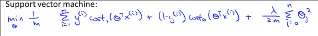

最右侧仍是正则化系数

但是对于支持向量机，通常不再除以样本数m

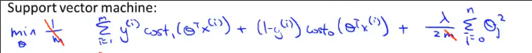

而正则化的控制不再使用λ，而是使用C，并且C为前者的系数，而非正则化项

因此完整的**支持向量机的成本函数**就是

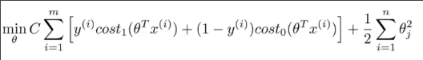

另一点与逻辑回归不同的是，其**模型函数不输出概率，在`z`大于等于0时，输出1，小于则输出0**

## 理解支持向量机

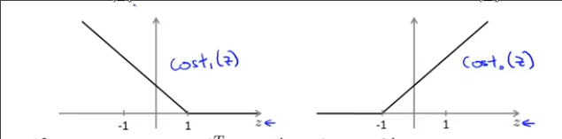

我们关注两个损失函数，如果想要让损失变小怎么做？

对于`cost_1(z)`，需要让z大于等于1，损失最小，此时预测为1

但是我们知道只要z大于等于0就是正确分类了，为什么还要让`z`大于等于1损失才为0？

这是一个**安全间距**

* 当正则化相关系数`C`非常大时，梯度下降算法期望损失函数项非常小
* 当`y`等于1时，也就是让`loss_1(z)`特别小，因此期望z大于等于1 损失为0
* 同理`y`等于0时，期望z小于等于-1

这种**安全间距**会促使SVM做出这种决策

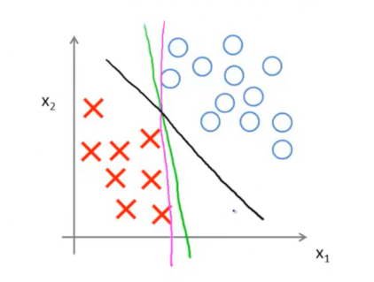

其将决策边界选择为**黑色**，而不是另外两种，尽管这三种都可以将样本完全区分，但是黑色并不是那么正正好好，距离样本有更大的**间距**

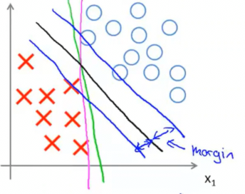

蓝色夹的区域称为**支持向量机的间距** *支持向量机也被称为大间距分类器*

但是当C特别大，大间距分类器就会对数据很敏感

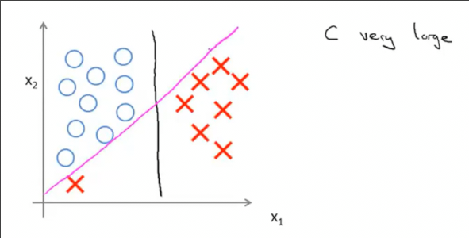

如果C不是很大，SVM得到的还是黑线，几个少量样本影响没那么大

## 为什么会产生大间距

### 向量点积

首先，假设u和v是两个二维向量

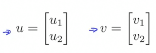

我们可以将其画出

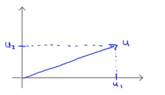

向量的**范数**就是其几何长度，根据勾股定理

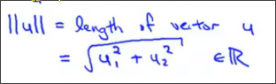

我们向计算u和v的点积，可以用投影的方式

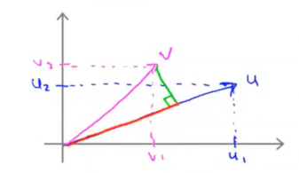

红色长度p乘以u的长度（范数）即为所求

其还等于向量的每一项相乘之和u1v1+u2v2

### SVM的决策

假设z中b为0 特征为2个

这是我们成本函数的**正则化项**

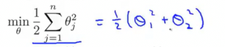

*θ通w*

可以写成

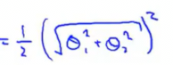

括号内即为向量`w`的**范数**，也就是w向量的长度

在梯度下降时，我们也就是想让w的范数尽可能小

而在**损失函数项**中

`z = wx` w和x都是向量，这是一个向量的点积

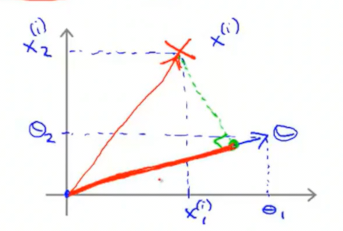

* 当y等于1时，我们希望z>1
* 当y等于0时，希望z<-1

因此就是**让x的投影p和w的范数乘积在相应范围**

对于这种边界

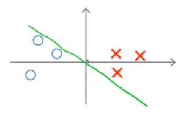

在一个坐标系中，数学上易证，决策边界和其w向量是垂直的

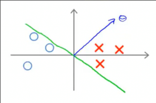

我们把各个样本向w向量上投影

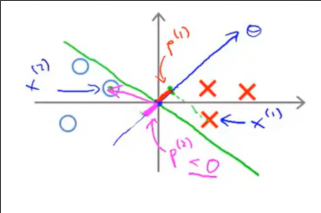

每个样本的投影p是一个绝对值较小的值，因此我们让z大于1或者小于-1就需要更大的w范数

而正则项又在阻止w不要太大，因此这个边界得到的损失偏大

而另一种边界

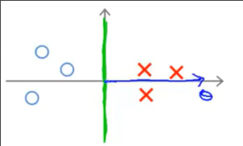

**每个样本会得到一个比之前绝对值相对较大的投影p**

因此要让损失函数项小一些，需要的w也不太大，那么正则项也就小了

因此svm倾向于做出这种策略

**SVM保持大间距的原因就是其希望每个样本在向量w的投影足够大** 大间距是使得投影足够大的唯一方式
