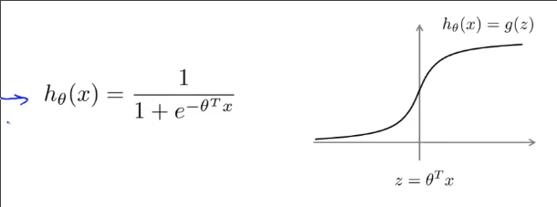

# SVM 支持向量机

## 损失函数 成本函数 模型函数

在学习更为复杂的非线性方程时，更加强大

这是我们在逻辑回归时的模型，`h/f(x)`是一个segma函数，它作用于`z=wx+b`

当真实的`y`等于1时，我们希望`f(x)`趋近于1，那么z就要趋近正无穷

这是逻辑回归一个样本的**损失函数**

当`y=1`时，损失函数即为

而支持向量机的损失函数在`y=1`时长这样

在`z=1`时发生转折 `loss_1(z)`

而`y=0`的时候，支持向量机损失函数在`z=-1`时发生转折 `loss_0(z)`

因此我们可以类比写出**支持向量机的成本函数**

最右侧仍是正则化系数

但是对于支持向量机，通常不再除以样本数m

而正则化的控制不再使用λ，而是使用C，并且C为前者的系数，而非正则化项

因此完整的**支持向量机的成本函数**就是

另一点与逻辑回归不同的是，其**模型函数不输出概率，在`z`大于等于0时，输出1，小于则输出0**

## 理解支持向量机

我们关注两个损失函数，如果想要让损失变小怎么做？

对于`cost_1(z)`，需要让z大于等于1，损失最小，此时预测为1

但是我们知道只要z大于等于0就是正确分类了，为什么还要让`z`大于等于1损失才为0？

这是一个**安全间距**
