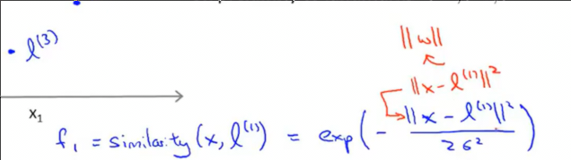
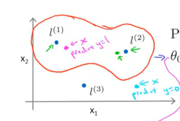
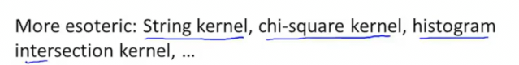

# SVM构建非线性分类
 
* [核函数](#核函数)
* [核函数的数学原理](#核函数的数学原理)
* [标记的获取](#标记的获取)
* [正则化参数C_核函数σ的选择_](#正则化参数C_核函数σ的选择_)
* [使用SVM](#使用SVM)
* [逻辑回归和SVM](#逻辑回归和SVM)

通过使用**核函数**

我们向做出这样一种分类决策

一种方式是划分出多项式特征

我们用f表示新的多项式特征

但是我们不知道什么样的高阶项我们需要？什么样不需要？

## 核函数

一种构建新特征f1 f2 f3...的方法

在特征空间中，这里假设我们使用两个特征

我们手动选取几个点，作为**标记** 

而`f1`特征定义为`x`和标记`l1`**某种相似度的度量**

具体为

而特征`f2`是`x`和`l2`的相似度

这个相似度函数在数学中称为**核函数**，我们使用的是**高斯核函数**

也写为

## 核函数的数学原理

* 当`x`和向量l1大致相等时，计算得到f1，大致为e^0为1
* 当x距离向量l1很远，f1大致e^(-一个大数)，大概为0

因此核函数就是衡量了样本x和标记l1之间的相似度 相似大致为1 差异则约为0，将此作为特征

我们有三个标记，因此对于一个样本，可以计算其离这三个标记的相似度，得到新的3个特征 f1 f2 f3

这是给定标记l1，对于不同特征x1 x2的样本，其新特征f1大小的函数

* σ是高斯核函数的参数，**减小会使得凸起减小**

我们通过传入一个样本，计算其和x1 x2空间中的三个标记的相似度，从而得到新的3个特征来替代x1 x2

因此预测模型变为

对于SVM，当模型函数大于等于0的时候预测为1，否则为0

如果x在如图的位置，那么特征f1就接近1，另外两个更接近0

假设参数为这些值

我们计算发现，对于离l1和l2近的点，被预测为1，其余预测为0

其决策边界是这样

## 标记的获取

我们如何选取l1 l2 ...?

1. 我们在第一个样本x1所在特征空间的位置，放置标记l1
2. 第二个样本x2位置放置标记l2
3. ...
4. 最终得到和所有样本对应的l1 .. l_m

因此最终我们对于一个样本，有m个新特征，m为训练集样本数，此外还有一个f0=1，和原来的截距一样，因此m+1个

输入样本x最终映射为f向量，再和w向量点乘以预测

z=wf + f_0 = wf + 1

此外后面的正则化项会求m次和，因为参数也变为m个，而不是原来的n

对于SVM核函数有一些可以优化的细节，比如正则项w向量可以乘以**某个核函数有关**的矩阵，再乘以w向量

这提高了计算效率，而其他算法中如逻辑回归不能应用，因此这也是核函数多应用于SVM的原因

## 正则化参数C_核函数σ的选择_

* C过大 高方差 低偏差 过拟合
* C过小 高偏差 低方差 欠拟合

* σ过大，对应的相似度函数很平缓，模型欠拟合 （变化缓慢）
* σ过小，相似度函数很陡，模型过拟合

## 使用SVM

常用的软件包有`liblinear` `libsvm`

* 要选择正则化系数`C`
* 选择核函数
  * 一种选择是**不选择核函数** 即线性 
    * 使用原特征x进行SVM拟合
    * 通常当n很大，而m很小时 防止拟合太复杂导致过拟合
  * 高斯核函数
    * 需要选择σ，来权衡偏差和方差
    * n值很小 但是m很大时

一些软件包需要用户提供核函数（相似度函数），以一个样本x和标记l为输入，输出其相似度

**如果特征的大小很不一致，注意传入核函数中前特征和标记归一化**

另一些核函数 不常用

* 多项式核函数 

* 字符串核函数
  * 输入数据是字符串时 文本分类
* 卡方核函数
* 直方相交核函数

## 逻辑回归和SVM

如何取舍？

如果n比训练样本m多，如文本（有许多特征）

通常用逻辑回归，或者线性核函数的SVM

如果n比较小（1-1000）而m很大小合适（也不是太大如一百万！）（10-10000） 可以使用高斯核函数

如何n很小1-1000，但是m很大 50000+ 需要添加更多特征！再使用逻辑回归或线性核函数

**神经网络或许对上面都很有效，但是训练缓慢**
