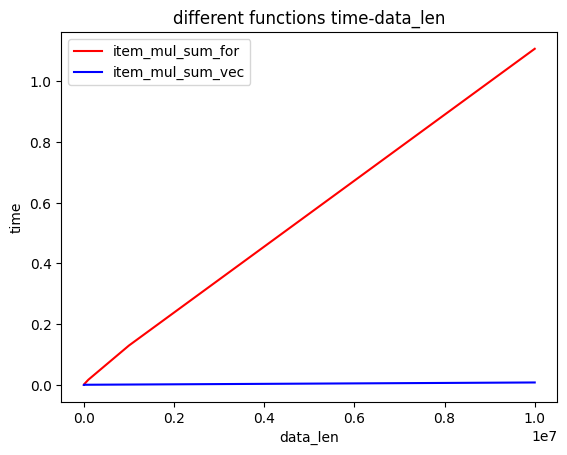
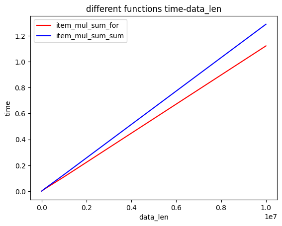
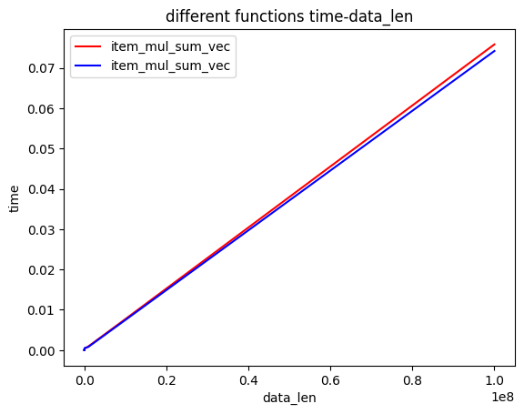

# 比较矢量化和for循环以及sum之间的效率

```python
import time
import numpy as np
import matplotlib.pyplot as plt
import matplotlib
```


```python
lenth = 1000000
data1 = np.array([51] * lenth)
data2 = np.array([61] * lenth)
```

这是一个修饰器，忽略原函数的返回值，将新的返回值变为执行函数所耗时间


```python
def return_time(f):
    def new_f(d1, d2):
        start = time.time()
        f(d1, d2)
        end = time.time()
        return end - start
    new_f.__name__ = f.__name__
    return new_f
```

下面是一个通过输入两个向量，用for的方式求其向量点积的函数


```python
@return_time
def item_mul_sum_for(d1, d2):
    sum = 0
    for i in range(d1.shape[0]):
        sum += d1[i] * d2[i]
    return sum
```


```python
print(item_mul_sum_for(data1, data2))
```

    0.14728021621704102


下面是一个通过输入两个向量，用np.dot的方式求其向量点积的函数


```python
@return_time
def item_mul_sum_vec(d1, d2):
    sum = np.dot(d1, d2)
    return sum
```


```python
print(item_mul_sum_vec(data1, data2))
```

    0.0019528865814208984


下面是一个通过输入两个向量，用sum配合列表表达式的方式求其向量点积的函数


```python
@return_time
def item_mul_sum_sum(d1, d2):
    s = sum([d1[i] + d2[i] for i in range(d1.shape[0])])
    return s
```


```python
print(item_mul_sum_sum(data1, data2))
```

    0.1560521125793457


下面这个函数输入一个限制时长，两个相同功能处理向量d1, d2的函数（其返回耗时），将会绘制达到限制时长之前两个函数 时间-数据量图像


```python
def plt_diff_time(max_time, f1, f2):
    lenth = 1
    time = 0
    x, y_f1, y_f2 = [lenth], [0], [0]
    while(time < max_time):
        lenth *= 10
        x.append(lenth)
        f1_time = f1(np.array([51] * lenth), np.array([63] * lenth))
        f2_time = f2(np.array([51] * lenth), np.array([63] * lenth))
        time = max(f1_time, f2_time)
        y_f1.append(f1_time)
        y_f2.append(f2_time)
    x, y_f1, y_f2 = np.array(x), np.array(y_f1), np.array(y_f2)
    plt.title("different functions time-data_len")
    plt.xlabel("data_len")
    plt.ylabel("time")
    plt.plot(x, y_f1, c='r', label=f1.__name__)
    plt.plot(x, y_f2, c='b', label=f2.__name__)
    plt.legend() 
    plt.show()
```


```python
plt_diff_time(1, item_mul_sum_for, item_mul_sum_vec)
```


    

    


```python
plt_diff_time(1, item_mul_sum_for, item_mul_sum_sum)
```


    

    


```python
plt_diff_time(0.01, item_mul_sum_vec, item_mul_sum_vec)
```


    

    

