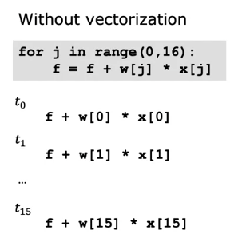
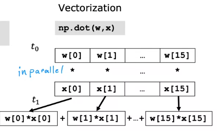
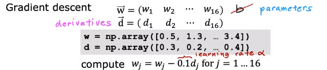
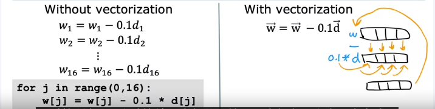
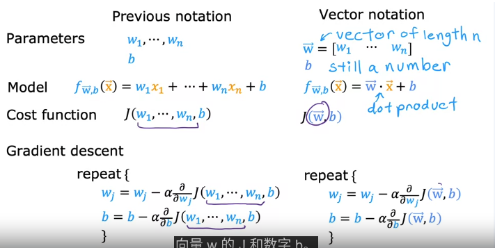
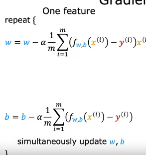
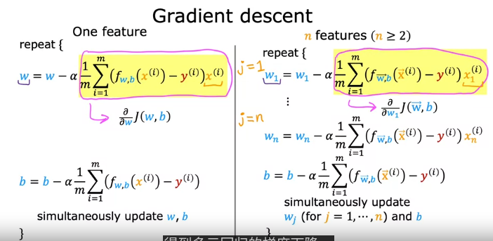

# 多特征线性回归
 
* [多特征](#多特征)
* [矢量化](#矢量化)
  * [矢量化的好处_python中的实现](#矢量化的好处_python中的实现)
  * [矢量化高效的原因](#矢量化高效的原因)
    * [矢量化在线性回归中的实际应用](#矢量化在线性回归中的实际应用)
* [多元线性回归中的梯度下降](#多元线性回归中的梯度下降)
* [找到适宜的w_b的另一种方法_正态方程](#找到适宜的w_b的另一种方法_正态方程)

## 多特征

在本单元，我们不只着眼于一个特征，而是多种特征

单元线性回归

而多元线性回归中

每一条数据中有多个输入`x`，记作`x1, x2, x3...`

* `x_j` 表示第`j`个特征
* `n` 表示**特征的总数**
* `x^(i)` 仍表示第`i`个训练示例的特征 在多变量中，`x^(i)` 是一个向量，其是一个含有多个特征的列表，因此`x`的上面加一个向量号

* 而某个训练示例的某个特征记作`x^(i)_j`

而模型函数也发生了变化

有多少个特征`x_i`就会有多少个w参数`w_i`

我们可以将w写成向量的形式，因此模型函数可以写为向量相乘的形式

## 矢量化

### 矢量化的好处_python中的实现

矢量化可以缩短代码，并且提高代码的运行效率

我们可以使用现代的线性代数库来完成矢量化，通过GPU（加快图形处理速度的硬件）也可以加快实现矢量化的代码

`python`中使用`numpy` *一个数值线性代数库* 完成矢量化 其在`python`和机器学习中被广泛使用

计算预测值时，如果不用矢量化，代码如下

即便是使用`for`循环 计算机执行的时候效率也很低

而矢量化如图

当n特别大时，这个方法的运行效率远高于前两者

其原因在与这个方法`.dot`可以在使用计算机的并行硬件

### 矢量化高效的原因

这是对比了矢量化、for循环、sum函数的[效率对比可视化](Unit3_矢量化效率/README.md) 使用`jupyter lab`编写并导出为`markdown`格式

对于普通的`for`循环，只是一个接一个地运行

而`np.dot`在具有矢量化功能的硬件中进行，计算机可以获取`w`和`x`中的所有值，**仅需一步就可以同时完成对所有元素的相乘**，之后同样用专门的硬件，将这些乘积**高效相加，同样只需一步**

#### 矢量化在线性回归中的实际应用

假设有一个具有16个特征的数据集

故我们向量w的长度为16，我们在这个例子中忽略b参数

因为要采用梯度下降更新参数，我们计算`w_1`-`w_1此外还有一个b参数6`的导数记作向量`d`

这我们在更新时，采用逐个更新和向量法一并更新的伪代码

在矢量化代码中，首先算`0.1`乘向量d，计算机的并行硬件同时对16个数相乘，之后是`-`，也是同时对`w`的所有位置减去相应的值，最后同时赋值给新w的所有位置。只需要三步

对于`np`数组，同样可以采用运算符的形式运算

## 多元线性回归中的梯度下降

我们将 模型函数、成本函数、梯度下降 都写成矢量的形式

而梯度下降的详细公式如下

当有多个特征时，公式成为这样

## 找到适宜的w_b的另一种方法_正态方程

可以代替梯度下降

相比梯度下降，**正态方程只适用于线性回归**，其不需要迭代就可以解出 w 和 b

缺点是

* 适用范围仅限于线性回归，而梯度下降适用于更多如**逻辑回归、神经网络等**
* 当特征数量非常大时，正态方程法也相当慢

当我们调用机器学习库中的线性回归方法，往往适用这种方法寻找 w 和 b
