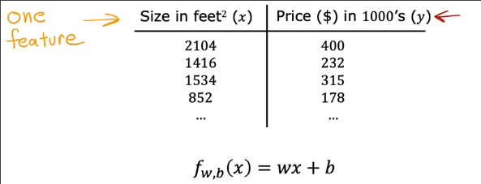
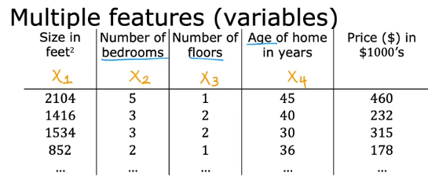
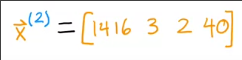
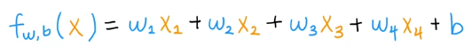
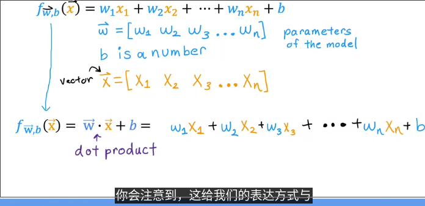
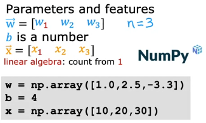
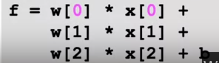
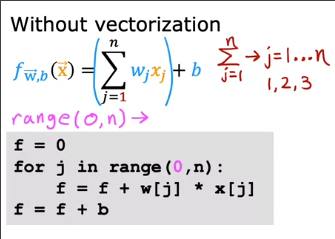
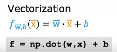

# 多特征线性回归

## 多特征

在本单元，我们不只着眼于一个特征，而是多种特征

单元线性回归

而多元线性回归中

每一条数据中有多个输入`x`，记作`x1, x2, x3...`

* `x_j` 表示第`j`个特征
* `n` 表示**特征的总数**
* `x^(i)` 仍表示第`i`个训练示例的特征 在多变量中，`x^(i)` 是一个向量，其是一个含有多个特征的列表，因此`x`的上面加一个向量号

* 而某个训练示例的某个特征记作`x^(i)_j`

而模型函数也发生了变化

有多少个特征`x_i`就会有多少个w参数`w_i`

我们可以将w写成向量的形式，因此模型函数可以写为向量相乘的形式

## 矢量化

### 矢量化的好处 python中的实现

矢量化可以缩短代码，并且提高代码的运行效率

我们可以使用现代的线性代数库来完成矢量化，通过GPU（加快图形处理速度的硬件）也可以加快实现矢量化的代码

`python`中使用`numpy` *一个数值线性代数库* 完成矢量化 其在`python`和机器学习中被广泛使用

计算预测值时，如果不用矢量化，代码如下

即便是使用`for`循环 计算机执行的时候效率也很低

而矢量化如图

当n特别大时，这个方法的运行效率远高于前两者

其原因在与这个方法`.dot`可以在使用计算机的并行硬件

### 矢量化高效的原因

这是对比了矢量化、for循环、sum函数的[效率对比可视化](Unit2_矢量化效率/README.md) 使用`jupyter lab`编写并导出为`markdown`格式

