# 利于线性回归的技巧
 
* [特征缩放](#特征缩放)
  * [特征缩放的作用](#特征缩放的作用)
  * [特征缩放的方法](#特征缩放的方法)
    * [除以最大值](#除以最大值)
    * [均值归一化](#均值归一化)
    * [Z-score_标准化](#Z-score_标准化)
* [检查梯度下降是否收敛](#检查梯度下降是否收敛)
  * [绘制学习曲线](#绘制学习曲线)
  * [自动收敛测试](#自动收敛测试)
* [选择学习率](#选择学习率)
* [特征工程](#特征工程)
* [多项式回归](#多项式回归)

## 特征缩放

### 特征缩放的作用

使得梯度下降更快

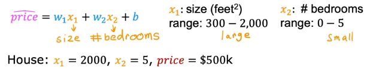

一些特征的大小可能差别过大

这样可能导致参数之间差别也过大

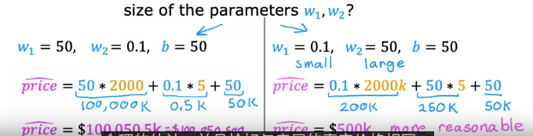

右侧是比较合理的参数

**当特征值很大时，训练较好的模型倾向于给其较小的参数**

绘制两个特征之间的图像，发现其比例相差很多

而其成本函数的等高线图也会是一个比较窄的图像

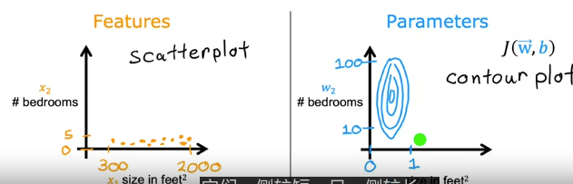

**其原因是对`w1`做很小的更改就会对预测产生非常严重的影响，而要对`w2`做很大的改变，才能产生同样的效果**

**这样会导致梯度下降不断徘回，最终才能找到通往全局最小值的路**

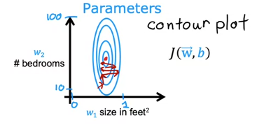

而改进此种情况的方法就是**特征缩放**

比如我们都将两种特征按照比例缩放到`0和1`之间

两个图像就合理多了

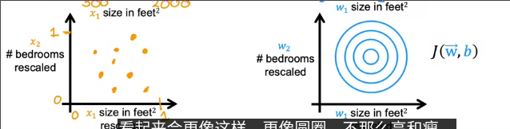

成本函数等高线图趋近圆形

### 特征缩放的方法

#### 除以最大值

比如`x`的范围在`300-2000`，我们可以这样缩放

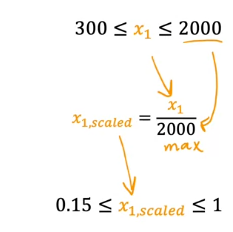

如果在`0-5`，则除以5

也就是**除以最大值**

这样把范围缩放到`0-1`

此外还可以进行**均值归一化**

#### 均值归一化

*使得均值为0，范围在-1到1*

1. 首先找到这个**特征在样本中的平均值**
2. 应用这个公式

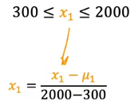

每个x减去均值除以范围

#### Z-score_标准化

需要计算每个**特征在样本中的标准差和平均值**

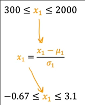

首先用减去平均值的值除以标准差

在进行特征缩放时，不一定要缩放到`-1-1`，接近的一些值也可以不缩放

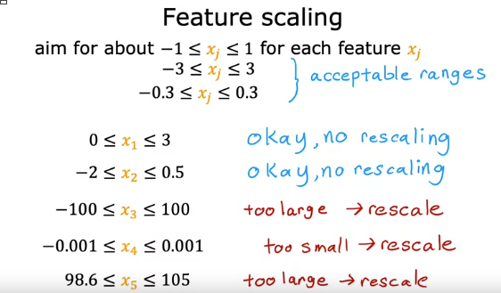

如果不知道该不该缩放，**缩放到合理范围始终没有坏处**

## 检查梯度下降是否收敛

### 绘制学习曲线

**绘制成本`J(w, b)`的值随着训练次数的变换曲线**

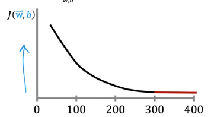

这条曲线也称为**学习曲线**

如果梯度下降正常，那么在每次训练后J都应降低，是一个减函数

如果某次训练后J出现上升的情况，意外着**学习率选择不佳**，通常是`α`选择过大或者代码中存在`bug`

从图像中也能看出大概300次训练后`J`趋近平稳，而在400次后，**曲线几乎变平，此时意味着收敛**

### 自动收敛测试

在某次训练后成本的减少量小于一个很小的常数如`0.001`则意味着收敛，此时结束训练 

*但是选择这个常数很困难，因此更多用绘制学习曲线，看是否平坦的方法*

## 选择学习率

当我们遇到**有时学习曲线上升有时学习曲线下降**的情况，那么此时梯度下降无法正常工作

* 可能是代码中存在错误
* 也可能是学习率过高

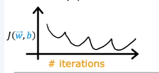

可以尝试使用较小的学习率

有时也会看到**学习曲线持续上升的情况**

* 也可能是学习率过高的原因
* 也可能是代码的问题

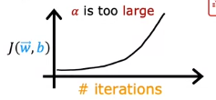

也尝试减小学习率

**如果怀疑是代码中的问题，可以设置学习率为一个非常小的数，这样每次成本都应降低，否则是bug**

**在选择的时候，我们可以先从`0.001`入手，之后每次增加3倍，对于每一个学习率，只迭代少量次数确定每次训练都是下降即可**

## 特征工程

**特征的选择对学习算法的性能有巨大影响**

如何选择？

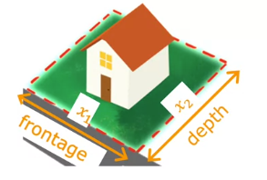

对于房屋预测来说，我们可以将**长度**作为一个特征，而**宽度**作为另一个特征

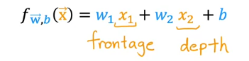

但是我们可以将其作为一个整体新特征为**面积** 直觉上来讲，面积比单独的长和宽更能预测价格

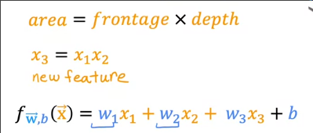

**可以通过对问题的直觉和知识来设计新特征** 通常是转换和组合原始特征

## 多项式回归

根据线性回归和特征工程，我们可以用非线性直线进行拟合数据

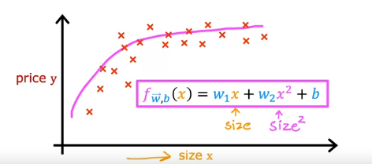

在这样一个数据集中，我们会想到尝试用二次、三次曲线来拟合

我们可以**将x^2、x^3作为新特征**

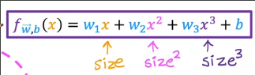

在这种情况，**特征缩放**非常重要

而选择什么样的曲线呢？在第二课我们将学到**关于特征取舍的知识**
