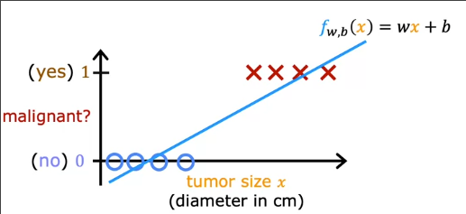

# 逻辑回归
 
* [为什么不用线性回归解决分类问题](#为什么不用线性回归解决分类问题)
* [逻辑回归](#逻辑回归)
* [决策边界](#决策边界)

本单元我们学习分类算法，使得**输出变量y只能取少量可能值中的一个**

## 为什么不用线性回归解决分类问题

这是一些分类算法的例子

* 邮件是否为垃圾？
* 金融交易是否有欺诈行为？
* 肿瘤是否为恶性？

特别地，上面的例子都是**二分类**

这是我们关于 *肿瘤是否恶性-肿瘤大小* 图像

同样也可以是数轴形式

如果我们用线性回归解决这个问题，最终拟合的曲线大致如下

但是其不仅仅预测值为0，1，其预测了所有值

据此，我们可以**选择一个阈值**如`0.5`

**将预测值在`0.5`以下的都视为0，0.5以上都视为1**

但是假设我们添加一个特外的差异很大的数据

我们会发现很多正例被分到`0`的区域

## 逻辑回归

*可能是使用最广泛的单一分类算法*

线性回归不是解决问题的好方法，我们希望拟合这样一条曲线来完成分类

我们引入`segma`函数 **逻辑函数**

其公式如下

* 当`z`非常小时，分母的指数项巨大，因此整体趋近0
* 当`z`很大时，指数项趋向于0，因此整体趋近1
* 当`z`等于0时，整体恰好为`0.5`

我们**对线性回归的结果应用`g(z)`**

结果就是最终预测的结果位于`0-1`

这就是**逻辑回归的模型函数**

对于`f_w,b(x) = 0.7`，则表示对于有70%的可能性y为1，对于这个问题，模型认为患者患有恶性肿瘤的概率为70%

## 决策边界

我们在将特征输入到预测函数`f_w,b(x)`中，得到一个介于`0-1`的值

之后我们具体把得到的值预测为0还是1呢？

可以**设置一个阈值**，超过则是1，低于则是0

常见是`0.5`

在这种该情况下，由于`z=0`时，`g(z)`恰好等于`0.5`，所以当`z`大于等于0时会被预测为1，小于0时会预测为0

以一个两个特征的数据集为例

线段 z = **w** * **x** + b 称为**决策边界**

当`z = w1x1 + x2x2 + b > 0`时，对应图像中分界线上方的部分，故决策为1

决策边界也可能不是一条线

当`z > 0`时，对应决策边界圆的外部，决策为1

**我们同样可以使得`z`是一个关于特征更复杂的多项式，可以得到更复杂的决策边界**
