# 逻辑回归的成本函数和梯度下降
 
* [逻辑回归的成本函数](#逻辑回归的成本函数)
  * [适合逻辑回归的损失函数](#适合逻辑回归的损失函数)
  * [逻辑回归的简化成本函数](#逻辑回归的简化成本函数)
* [梯度下降](#梯度下降)

## 逻辑回归的成本函数

### 适合逻辑回归的损失函数

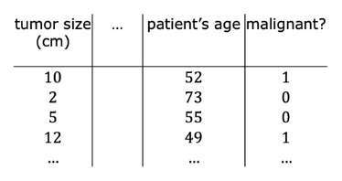

这是一个逻辑回归的训练集

我们期望得到一个合适的**模型函数**

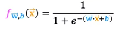

那么如何选择合适的`w`和`b`呢

这是**线性回归的成本函数** *平方误差成本函数*

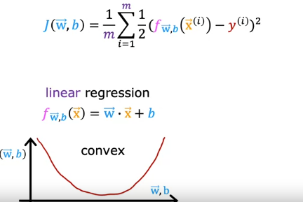

我们尝试用这个成本函数来判断逻辑回归的`w`和`b`是否适宜

对于不同的`w`和`b`我们确定一个损失，最终绘制出的图像如下

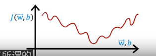

**这并不是一个凸函数**，在梯度下降时，会有许多极小值

故**平方误差成本函数对于逻辑回归不是一个好选择**

在平方误差成本函数中，我们将对于单个样本的这一项称为**单个样本的损失**

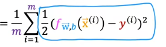

记作

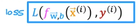

而对于另外的单个样本损失函数`L(f, y)`，适宜于逻辑回归

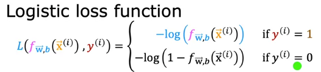

`f`作为逻辑回归模型的输出，其值总是介于`0和1`

我们关注`log`图像的`0-1`部分

* 当`y`值实际为1，而预测值`f`接近于1，那么带入得损失几乎为`-log(1) = 0`
* 当`y`值实际为1，但是预测值`f`却接近0，那么损失非常大 `-log(0) = inf`
* 当`y`实际为0，得到结果也是这样，在预测值接近0时，损失大概为0，接近1时损失最大

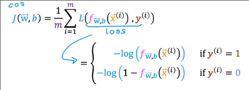

并且证明逻辑回归选择的成本函数**总是凸的**

### 逻辑回归的简化成本函数

我们可以将**损失函数的两种情况合并**

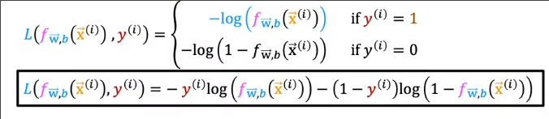

我们对所有样本的损失求和取平均得到**逻辑回归的成本函数**

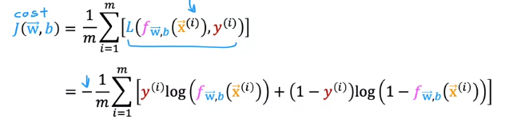

我们之所以选择这个损失函数，是由于其是从**极大似然原理**从大量样本中估计而来

## 梯度下降

同样地，我们希望找到可以最小化`J`的`w`和`b`

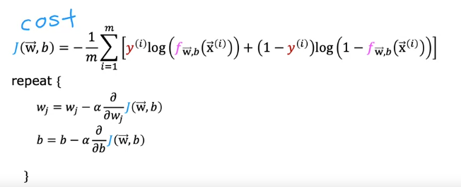

通过微积分，导数项可以化为如下形式

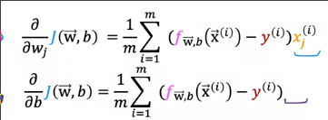

和我们在线性回归中的导数项计算形式一致，只是`f`发生了变化

**`w`和`b`同步更新**

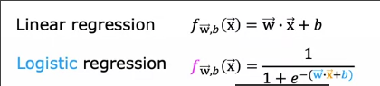

确定收敛的方法和线性回归中一致
