# 过拟合问题
 
* [过拟合和欠拟合](#过拟合和欠拟合)
* [解决过拟合的方法](#解决过拟合的方法)
  * [更多数据集](#更多数据集)
  * [选择最相关特征子集](#选择最相关特征子集)
  * [正则化](#正则化)
* [正则化成本函数](#正则化成本函数)
* [正则化线性回归](#正则化线性回归)
  * [解释导数项的意义](#解释导数项的意义)
  * [导数项的微积分推导](#导数项的微积分推导)
* [正则化逻辑回归](#正则化逻辑回归)

## 过拟合和欠拟合

有时候线性回归和逻辑回归会遇到过拟合的问题

回到我们的房屋估价模型进行线性回归

一种模型是选用线性的拟合函数

但是可以看出这种模型效果不是很好，原因在与随着房屋面积增加，价格实际上趋平缓

这实际上是模型对数据**欠拟合**，另一种说法是该算法具有**高偏差**

我们试着选用二次模型来拟合 

这个模型**不仅对训练集表现很好，同样对其他新事例表现很好**

另一种模型选用四阶表达式

这种模型对训练集拟合很好，但是对于某些**另外的**数据表现不好。其发生了**过拟合**，也可以说这个算法具有**高方差**

这是逻辑回归中过拟合和欠拟合的示例

## 解决过拟合的方法

### 更多数据集

这是一个过拟合的模型

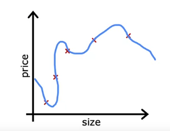

一种解决的方法是**收集更多的数据来训练**

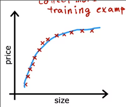

### 选择最相关特征子集

但是有时候数据确实不够，无法增加训练集

还可以**尝试能否使用更少的特征**

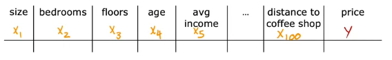

如果有**太多的特征，但是却没有足够多的数据用于训练** 也很有可能过拟合

不如选择特征中最有用的一些，**特征选择**有用的方法往往靠直觉

在课程2中，我们会有一些算法自动选择最合适的特征集

### 正则化

另一种方式是正则化

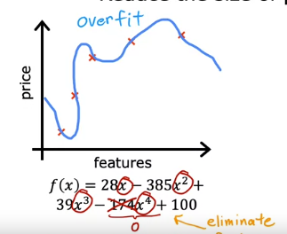

将某一项设置为0，相当于取消这项功能

**正则化是一种相比于直接删除更温和减少某些特征影响的方法**

正则化**鼓励学习算法减小参数的值**

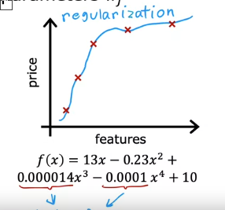

我们通常只减小`w_i`，`b`可以不减小，没什么区别

## 正则化成本函数

基于上述减小`w_i`，为学习算法开发一个经过修改的成本函数，以用于实际应用正则化

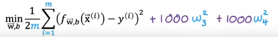

假设我们将成本函数改为这种形式

当`w3`和`w4`变得很大时，模型会受到惩罚，成本增加很多

但是我们或许不知道什么是有用的特征，故实现正则化的方式是惩罚所有`w_j`

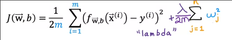

* `λ` 称为**正则化参数** 是一个大于0的数，和学习率一样，需要我们自行选择
* 对于新的损失函数，第一项表示拟合数据所带来的损失，第二项表示`w`太大(往往是过拟合)所产生的损失
* 故`λ`也代表二者的权衡和相对重要性
    * 当`λ`太小(接近0)，代表我们对`w`太大这件事不太关系，可能会出现**过拟合**，复杂的曲线
    * 当`λ`太大，代表我们非常想避免`w`太大，结果就是每个`w`都接近零，会**欠拟合**

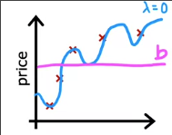

## 正则化线性回归

对于线性回归在正则化`w_i`的导数项发生了变化

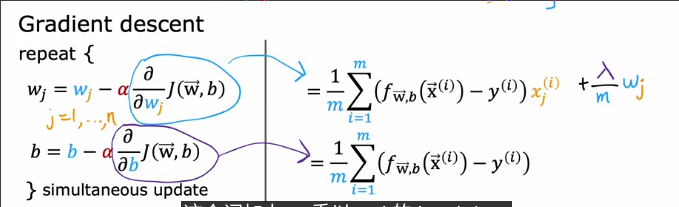

### 解释导数项的意义

我们重新排列以下`w_j`的更新

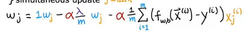

最后一项是**梯度下降的正常更新**，而前两项可以结合为

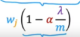

这是`α` `λ` `m` 一种可能的取值

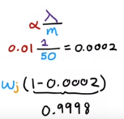

计算得到其整体是一个很小的整数

因此**每次更新把`w_i`更新为一个稍小(比如0.9998`w_i`)的`w_i`**，之后正常更新

*这与正则化的工作相吻合*

### 导数项的微积分推导

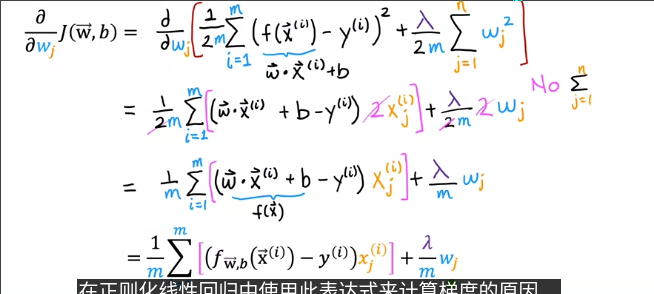

## 正则化逻辑回归

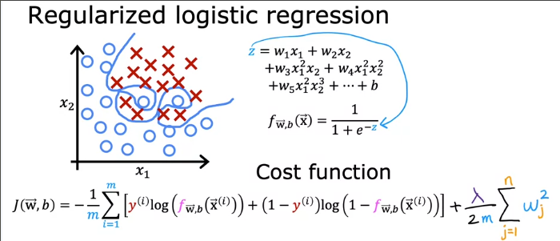

而其梯度下降导数项和正则化线性回归导数项形式相同

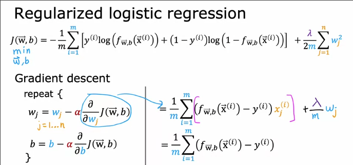
