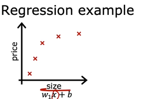
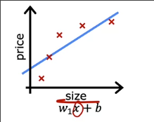
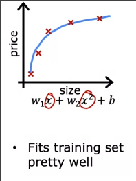
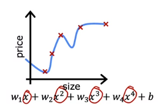
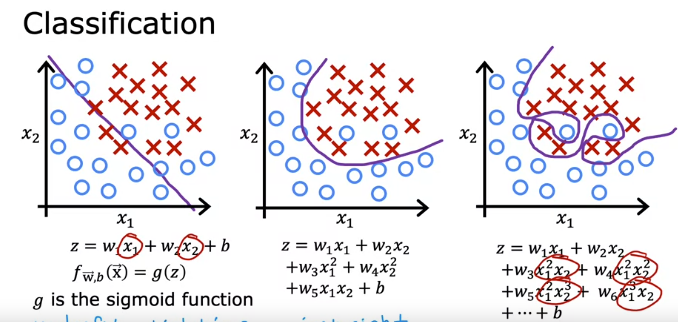

# 过拟合问题

## 过拟合和欠拟合

有时候线性回归和逻辑回归会遇到过拟合的问题

回到我们的房屋估价模型进行线性回归

一种模型是选用线性的拟合函数

但是可以看出这种模型效果不是很好，原因在与随着房屋面积增加，价格实际上趋平缓

这实际上是模型对数据**欠拟合**，另一种说法是该算法具有**高偏差**

我们试着选用二次模型来拟合 

这个模型**不仅对训练集表现很好，同样对其他新事例表现很好**

另一种模型选用四阶表达式

这种模型对训练集拟合很好，但是对于某些**另外的**数据表现不好。其发生了**过拟合**，也可以说这个算法具有**高方差**

这是逻辑回归中过拟合和欠拟合的示例

## 解决过拟合的方法

