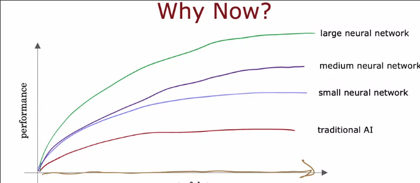

# 神经网络认知
 
* [神经元和大脑](#神经元和大脑)
  * [大脑的工作方式是什么？](#大脑的工作方式是什么？)
* [为什么神经网络现在才兴起](#为什么神经网络现在才兴起)
* [神经网络的工作原理_](#神经网络的工作原理_)
  * [例子_需求预测](#例子_需求预测)
  * [例子_四个特征](#例子_四个特征)
* [例子_计算机视觉](#例子_计算机视觉)

被称为**深度学习**，其与决策树是最强大，使用最广泛的机器学习

本课程中我们将学习到**如何构建机器学习系统的实用建议**

## 神经元和大脑

当神经元被发明时，最初的动机是**编写能够人脑或生物大脑学习和思考方式的软件**，但如今神经网络的工作方式**与我们认为的大脑工作和学习方式截然不同**

* 现代神经网络产生巨大影响的第一个领域是**语音识别**
* 之后其涉足**计算机视觉**
* 之后是**自然语言处理**

### 大脑的工作方式是什么？

**神经元**发出电脉冲，有时还会与其他神经元形成新的连接

* 一个神经元接受很多**来自其他神经元输入**
* 其进行一些计算，**通过电脉冲输出到其他神经元**

由**树突**输入，**轴突**输出

人工神经网络采用一个间接的定义描述神经元的作用

* 神经元接受**一些输入**，其是一些数字
* 进行一些**计算**
* **输出一些数字**，其可能传递给其他神经元

而一些神经元的整体也做同样的工作

*但是这不只是大脑的全部工作，大脑中的一些问题有待突破*

即使是我们已经使用了如此简单的简化模型，同样可以构建出强大的深度学习模型

## 为什么神经网络现在才兴起

这些年来，我们的数据量爆炸式增加，而对于传统的机器学习算法如线性回归和逻辑回归，其性能提升缓慢

但是如果训练一个小型的神经网络，其性能提升更明显，而中型和大型就特别显著了

此外，GPU在深度学习方面也非常强大，其快速发展也推动了深度学习

## 神经网络的工作原理_

### 例子_需求预测

某件T恤会不会成为最畅销的产品？

我们可以采用逻辑回归，拟合出`sigmoid`函数曲线，也就是逻辑回归的输出`f_w,b(x)`，我们记作`a`

`a`实际上是指`activation`，指**神经元在多大程度上向下游的其他神经元发送高输出**

这个逻辑回归的推理过程，可以看作大脑中**单个神经元非常简化的作用**

### 例子_四个特征

* 价格 运费 营销 材料质量

我们可能认为能否畅销可能和**实惠程度** **辨识度** **高质量**有关

* 而实惠程度大约是**价格**和**运费**的函数,这就是一个神经元的任务，其判断人们是否认为其实惠？
* 辨识度应该是**营销**的函数
* 高质量应该是**材料质量 和 价格**的函数

最后又有一个神经元对这三个神经元的输出整合

* 前面三个神经元称为一**层**
    * 一层神经元即一组接受相同或相似特征并同时输出的一组神经元
* 右边的神经元也是一层
    * 其在最右侧，也称为**输出层**
* 如**实惠程度** **辨识度** **高质量**这些中间特征称为**激活** *activations* *指的是神经元发送高输出向其下游神经元的程度*
* 最左侧的原始输入特征也称为**输入层**
* 除**输入层**和**输出层**，其余被称为**隐藏层**

但是在神经网络变得很大时，手动决定每个神经元计算什么特征变得不太现实。

因此神经网络的工作方式是每层的神经元自由接受上游的所有输入，而设置适当参数，来忽略不需要的

因此，宏观来讲，将每层的输入输出作为一个向量，其整体输入了每层(这一层的每个神经元都知道这个向量)，而这一层的神经元又输出另一个向量给下游

单单就这张图

可以发现只是一个逻辑回归，使用我们**并未在训练集中包含**的特征

因此这可以看作一个**可以自我学习特征的逻辑回归**

神经网络的一大特点就是我们不用自己手动设计特征，而是可以学习自己的特征

我们假设了这个神经网络的中间层计算的特征是这三种，实际上神经网络会**自己弄清其所要计算的特征**

这是一些多层网络的例子

我们训练神经网络时要决定的之一是我们需要多少隐藏层，每个隐藏层需要多少神经元

## 例子_计算机视觉

我们想要构建一个人脸识别应用程序，我们需要训练一个神经网络，**以这样的图片输入，输出这个人的身份**

输入可以表示为一个大矩阵，可以展开为一个长矢量**x**

在神经网络中的传播如下

我们或许好奇其中的激活矢量代表什么

我们取一个在大量图片中训练好的神经网络，取其中隐藏层的输出，进行可视化

* 会发现在第一个隐藏层中，第一个神经元可能在寻找**一些垂直线的边缘**，第二个**可能找一些斜线的边缘**，第三个可能**在某个方向寻找一些线**等等。因此第一层神经元在图像中**寻找非常短的线条或非常短的边缘**
* 第二层可能**学会将非常小的边和线段组合**以寻找**面部的一部分**
* 第三层会**聚合脸部的不同部分，尝试检测是否存在更大，更粗糙的脸型**

而汽车的检测也是类似的激活矢量

