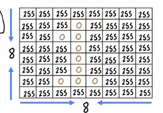

# 神经网络模型
 
* [神经元层的工作](#神经元层的工作)
* [更复杂的神经网络](#更复杂的神经网络)
* [前向传播](#前向传播)

## 神经元层的工作

大多数现代神经网络的基本组成部分是**神经元层**，我们将学会**如何实际构建一层神经元

这是一层神经网络，**每一个神经元进行单独的逻辑回归**

* 对于每一个逻辑回归神经元都有自己的`w_i`, `b_i`
* 带入到自己的g(**w_ix** + b_i)中，得到激活输出`a_i`
* 对于这一层所有的`a_i`结合为矢量**a**

输入层也被称为第0层，第一个隐藏层成为第1层，不同层的参数和输出用上标`^[i]`区分

而第2层接受`a^1`，进行逻辑回归

## 更复杂的神经网络

这是个4层的神经网络，3个隐藏层，1个输出层

对于其中的第3层，有如下计算

通过上游激活矢量 `a^[2]`逻辑回归计算本层的`a_1` - `a_3`

这是**输出激活值一般的公式**

* `g`在逻辑回归中，表示`segma`函数，其在神经网络中还有一个名称为**激活函数** *其输出了激活值* 除了`segma`，还有一些激活函数
* 输入向量**x**也写为`a^[0]`

## 前向传播

让神经网络做出预测

这是识别手写0、1的例子 一个二元分类问题

我们使用一个三层的神经网络

1. 首先第一个隐藏层的任务是从**x**计算到`a^[1]`

2. 从`a^[1]`到`a^[2]`

3. 最后来到第三层，也就是输出层

所以这个网络整体就是一个关于`x`的函数

这种计算也叫**前向传播**，另一种用于学习的算法，称为**反向传播**
