# 机器零件的强度

## 变应力的特性

* 变应力的产生 **变载荷**、**静载荷**
* 变应力的基本参数 `segma_max`、`segma_min`、`segma_m`、`segma_a应力幅`、`r循环特性`
    * `segma_m = (segma_max + segma_min) / 2`
    * `segma_a = (segma_max - segma_min) / 2`
    * `r = segma_min / segma_max`
    * `segma_max = segma_m + segma_a`
    * `segma_min = segma_m - segma_a`
    * `segma_a / segma_m = (1 - r) / (1 + r)`
* 稳定循环变应力的分类：**对称循环变应力、脉动循环变应力、非对称循环变应力**  
    * 稳定循环变应力：`segma_m segma_a T都为常数`

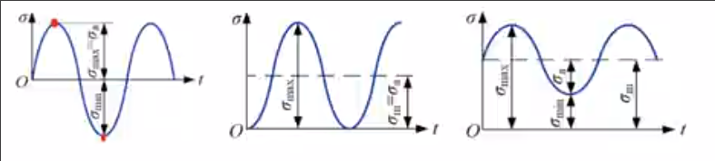

## 材料的疲劳曲线

`segma_max-N`曲线

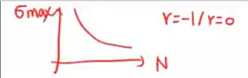

* 材料的疲劳特性的描述 **最大应力`segma_max`**、**应力循环次数`N`**、**应力比`r`**
* 疲劳曲线的意义 描述一定应力比`r`下，疲劳极限（以最大应力`segma_max`表征）与应力循环次数`N`的关系
* 疲劳曲线的三个阶段

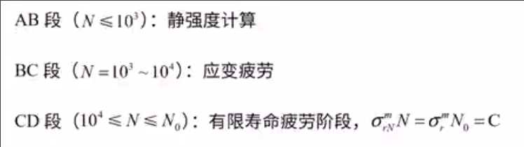

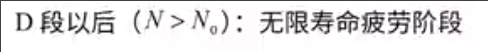

* BC段 应变疲劳 又称低周疲劳
* CD段和D段后为**重点**

### 疲劳方程

* CD `10^4 - N_0 循环基数` 有限寿命疲劳阶段 其每个极限`segma_rN`称为有限寿命疲劳极限
    * `segma_rN^m * N = segma_r^m * N_0 = c` 疲劳方程
    * `segma_r`为循环基数对应的疲劳极限,称为**持久疲劳极限或无限寿命疲劳极限**
* D段之后趋近于直线，其极限趋近于`segma_r`持久疲劳极限 `segma_rN = segma_r`

## 材料的极限应力线图

`segma_a - segma_m`曲线

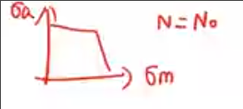

* 反应**特定寿命条件下**，最大应力`segma_max`与应力比`r`的关系

### 材料极限应力线图的画法

1. 建系

建立 `segma_a - segma_m` 坐标系 

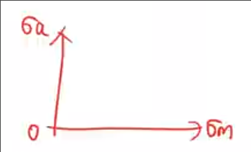

2. 描点

分别画出 `A' D' C` 点

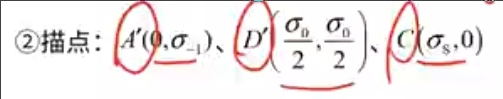

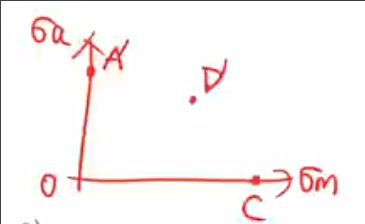

3. 画线

* 连接`A' D'` **疲劳极限线**
* 过`C`作与横轴正方形成135度的直线，相交与`G'` 

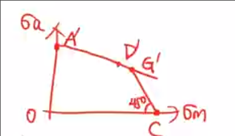

`A'G'C' 即为材料的极限应力曲线

## 零件的极限应力线图

### 影响零件疲劳极限的因素

* 应力集中 *发生在截面的形状突变处* 材料的强度极限越高，对应力集中越敏感 比如合金钢
    * 因此使用合金钢制造零件时，要**增大过渡圆角的半径，建校表面粗糙度**
    * 当同一截面上有多个应力集中源时，取各有效应力集中系数中**最大值**用于疲劳强度计算
* 绝对尺寸 **零件的绝对尺寸越大，疲劳极限越低**
    * 绝对尺寸越大，缺陷越多
    * 表面强化层也相对较薄
* 表面状态 **零件表面越粗糙，疲劳极限越低** 对零件表面进行强化处理可以提高零件的疲劳极限
    * 磨削的零件比精车的零件疲劳极限高

### 综合影响系数 K_segma

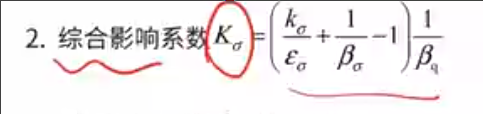

* `k_segma`为**应力集中系数**
* `delta_segma` 为**绝对尺寸系数**
* `beta_segma` 为**表面质量系数**
* `beta_q` 为**强化系数** **默认取1**

`综合影响系数 K_segma`只影响应力幅`segma_a`而不影响平均应力

### 零件的极限应力线图画法

1. 建系 `segma_a - segma_m`

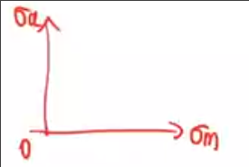

2. 描点 

`A D C`

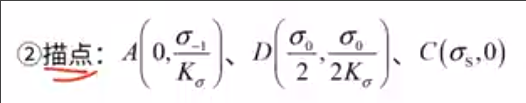

3. 画线

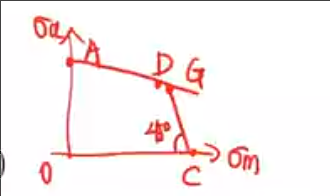

ADC为零件的极限应力曲线

### 提高机械零件的疲劳强度的措施

* 降低应力集中的影响 如**增大过渡处的圆角半径或采用减载槽**
* 选用疲劳强度高的材料和规定能够提高材料疲劳强度的热处理方法及强化工艺
* 提高零件的表面质量
* 尽可能减小或消除零件表面可能发生的初始裂纹的尺寸

## 单向稳定变应力下机械零件的疲劳强度计算

### r=c

* `OAG`区域的M点 o点引出通过工作应力点M的射线，交点`M'`为极限应力点
    * 由于`M'`点落于疲劳极限线AG，故M点可能的失效为疲劳破坏,对其进行疲劳强度计算
    
#### 疲劳强度的计算

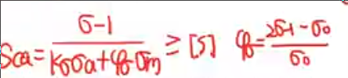

* `S_ca = (segma_(-1)) / ((k_segma)*(segma_a) + (phi_segma)*(segma_m)) >= [s]`
    * `phi_segma` 等效转化系数
    * `phi_segma = (2segma_(-1) - segma_0) / segma_0)`

* `OGC`区域的点
    * 同样的射线，交于`N'`,其在`CG`**屈服极限线**上
    * 可能发生的失效为**塑性变形**, 对其进行静强度计算

#### 静强度计算

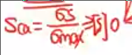

`S_ca = segma_s / segma_max >= [s]`

### segma_m=c

作垂直于x轴的射线 分为疲劳强度计算和静强度计算

### segma_min=c

分别过o和G作于横轴45度射线

第一个区域不考虑

第二个区域45度射线，疲劳强度计算

第三个区域45度射线，静强度

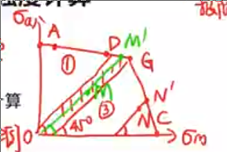

## 单向不稳定变应力下机械零件的疲劳强度计算

**受到多级变应力的作用**

### 疲劳损伤线性累计假说 满乃尔法则

每一级应力造成损伤率的总和达到100%时，零件发生疲劳断裂

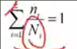

* `N_i`
