# 轴向拉伸和压缩
 
* [拉压变形的定义](#拉压变形的定义)
* [内力、截面法、轴力、轴力图](#内力、截面法、轴力、轴力图)
  * [内力_截面法_轴力](#内力_截面法_轴力)
  * [轴力图](#轴力图)
* [拉压杆的应力](#拉压杆的应力)
* [强度条件、安全系数、许用应力](#强度条件、安全系数、许用应力)
* [拉压杆的变形_胡克定律](#拉压杆的变形_胡克定律)
* [应变](#应变)
* [拉压杆的横向变形](#拉压杆的横向变形)
* [材料在拉伸和压缩时的力学性能](#材料在拉伸和压缩时的力学性能)
  * [低碳钢试样的拉伸图及其力学性能](#低碳钢试样的拉伸图及其力学性能)
  * [拉伸过程四个阶段的变形特征及应力特征点](#拉伸过程四个阶段的变形特征及应力特征点)
  * [塑形指标](#塑形指标)
* [金属材料在压缩时的力学性能](#金属材料在压缩时的力学性能)
  * [无屈服阶段的塑形材料](#无屈服阶段的塑形材料)
  * [灰口铸铁在拉伸时的segma-epsilon曲线](#灰口铸铁在拉伸时的segma-epsilon曲线)
  * [铸铁压缩时的segma-epsilon曲线](#铸铁压缩时的segma-epsilon曲线)

## 拉压变形的定义

变形特点: 轴线方向伸长(缩短)同时横向缩短(伸长)

几何形状：等直杆 *轴线笔直 横截面的形状和尺寸不变*

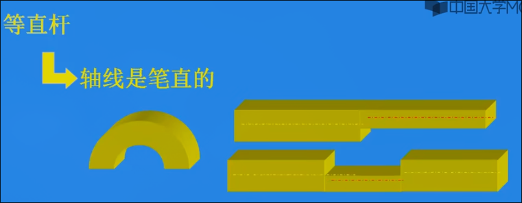

由于右侧杆的轴线中间有折断，故也不是等直杆

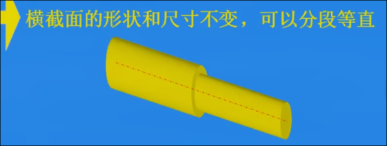

尽管横截面尺寸变化，但是允许横截面分段，它也是等直杆

受力特点：外力或其合力的作用线与轴线重合 *拉杆 压杆*

## 内力、截面法、轴力、轴力图

### 内力 截面法 轴力

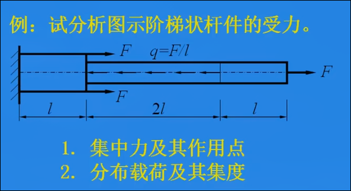

杆上的两种力：集中力 分布载荷（均布荷载 *其密度称作集度 N/m*）

受力分析：

1. 求支座反力：
    * 取分离体 *求支座反力时，一般直接取整体*
    * 假设支座反力向右, 列平衡方程

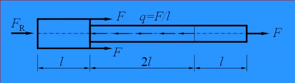

`F_R + 2F - q * 2l + F = 0` 分布荷载合力的计算为**极度\*长度**

`F_R = -F`

2. 求第一段的内力
   * 把整个杆截开后的左（或右部分，依据哪里易于计算）作为分离体
   
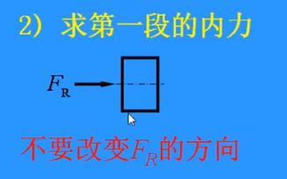

尽管之前计算的`F_R`是负值，实际方向与假设方向相反，仍不必改变假设的方向和值，进行受力分析列出平衡方程

把这种内力称为轴力，用`F_N`表示

`F_R + F_N1 = 0`

`F_N1 = F` 因此左段的轴力方向与假设方向相同，向右，大小为F

但是右段求得的轴力根据力的相互作用，会向左，因此依据方向规定轴力的正负是不可取的

因此规定**轴力的方向，离开截面为正，指向截面为负**， *拉（分离体）为正，压为负*, 我们通常将未知轴力按照正向来假设

### 轴力图

1. 建立 `F_N-x`坐标系，`x`轴的长度最好与轴长相同
2. 找到之前计算的每一段轴力 `F_N1 F_N2 F_N3`
3. 根据每一段的轴力，在坐标系中对应位置标出轴上每一点的轴力
    * 标出每一段的数值
4. 连接突变的点(首尾也连到0)

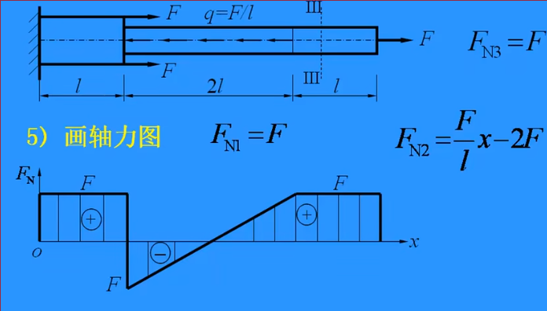

* 最后标上正负
* 画上垂直于x轴的竖线
* 以及各段(点)的数值大小

**轴力图特点**

没有荷载作用的区段，轴力图为水平线。

集中力作用处，轴力图突变，突变的幅度为此截面上集中力的代数和

**分析轴力时注意**

均布荷载作用的区段，轴力图为斜直线

* 计算时，分割截面不应在集中力作用截面上
* 荷载不能平移

## 拉压杆的应力

杆的强度由**轴力**和**横截面尺寸**两部分决定

应力：轴力作用的截面上，每个点摊到的轴力 *垂直于截面的应力称为正应力*

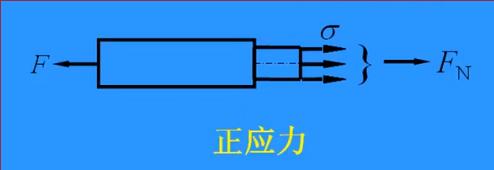

轴力的计算公式 `sigme = F_N / A` 单位 N/(m^2) - pa MPa GPa

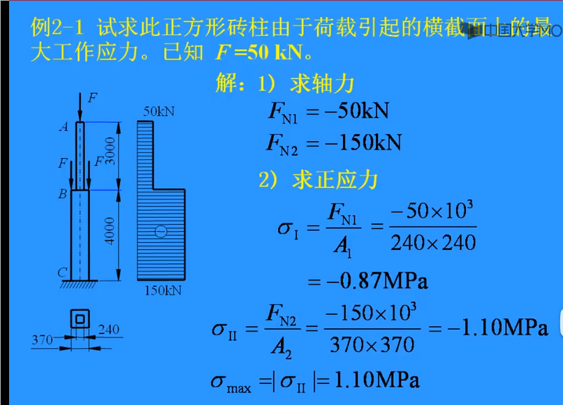

轴力计算公式的适用条件

* 拉压变形的平面假设成立
    * 在集中载荷作用区附近和截面发生剧烈变化的区域，横截面上的应力情况复杂，上述公式不再正确
    * 应力集中：集中力作用点附近，发生“鼓包”现象，靠近集中力的区域应力大，稍微远离的部分应力小
    * 对于大多数截面来说，这个公式都使用，某些特殊截面不适用（变形后平面假设不再成立）

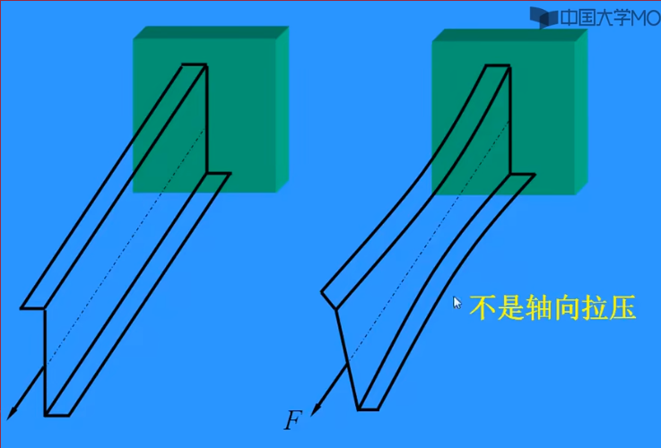

减小应力集中：

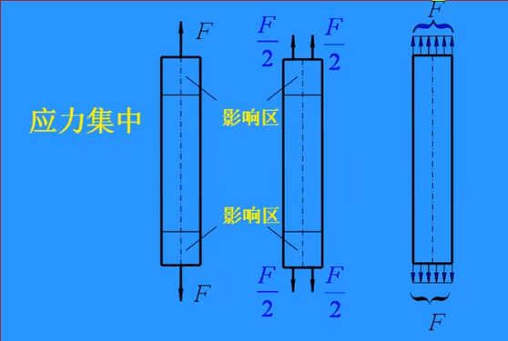

* 尽量不要在杆上打孔，如果要打孔，则打圆孔，避免尖锐的孔
* 阶梯状杆，在截面变化处，使用弧形倒角过度

截面横截面大小发生突变，或者杆件上打孔，其附近都会出现应力集中现象，**这些应力集中现象的影响范围都不会超过杆的横向尺寸**（*圣维南原理*）

材料力学中，计算中不考虑应力集中，使用平均应力计算

## 强度条件、安全系数、许用应力

强度条件 `sigma_max 最大工作应力 <= [sigma] 许用应力`

等直杆 `F_N_max / A <= [sigma]`

最后计算出最大工作应力后的写法

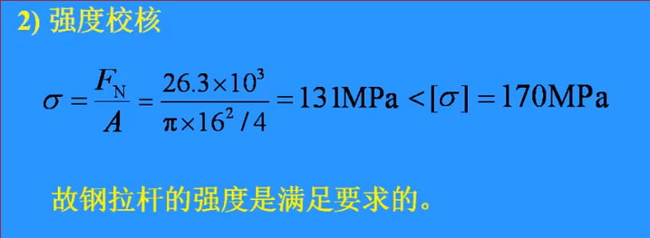

## 拉压杆的变形 胡克定律

拉压杆的纵向变形`delta l`正比于`Fl/A`

因此 `delta l = F 轴力 l/EA` **拉压胡克定律**

* 只能在线弹性的范围内适用
* `E` 被称为**弹性模量** 其作为分母 *相同条件下，E越大，变形越小*，因此其体现了**材料的软硬程度** 其单位与应力相同
* `EA` 整体称为杆件的**拉压刚度** *E是材料的指标，而EA是杆件的刚度指标*
* 计算长度内 `F E A` 必须为常数

**叠加法** 当一个结构上有多个外力作用时，其变形等于每个外力单独作用时的变形之和

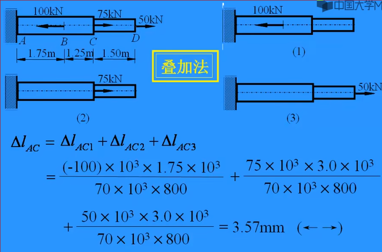

相对位移即为变形 

**刚度条件** `delta l <= [delta l]` 或者位移量

## 应变

之前我们研究的变形`delta l`指的是绝对变形

而线应变 `epsilon = delta l / l` 更能反应不同长度杆的变形程度 *无量纲*

计算公式：由胡克公式可得 `epsilon = F_N / EA = segma / E`

同样要在轴力和面积不变情况下，计算出的单独线应变才有意义, 否则算出的是平均线应变（由于各部分变形程度不同）

## 拉压杆的横向变形

绝对变形 `delta d  = d_1 - d`

相对变形 `横向 epsilon' = delta d / d `

横向线应变与纵向线应变的比值是常数 `mu = | epsilon' / epsilon |`  *横向变形效应*

`mu`称为横向变形因素或泊松比

不仅仅是直径，**垂直于轴线的横截面内，任意两点之间线段的变形关系均符合横向变形规律**

## 材料在拉伸和压缩时的力学性能

力学性能取决于**内部结构**和**外部环境**

本节只讨论**常温 静载 轴向拉压变形**下的力学性能

### 低碳钢试样的拉伸图及其力学性能

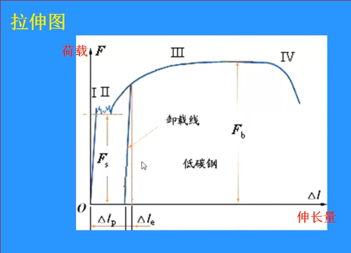

这种拉伸图的问题在于对于不同尺寸的试样来说，其载荷-伸长量位置不一

因此使用 `segma - 伸长量` 改进

但是由于 `segma = F / A`, `A`在不同载荷下不同，很难实时确定，因此使用原始尺寸

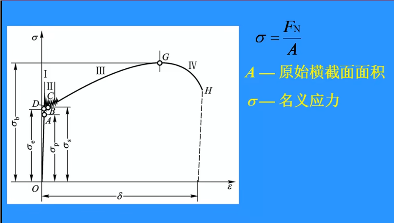

这种方法计算出的应力为名义应力, 比实际应力小，（没有考虑截面的缩小）

而`epsilon = delta l / l`也使用原始标距`l`计算**名义线应变**

因此得到**应力-应变**曲线

### 拉伸过程四个阶段的变形特征及应力特征点

1. 弹性阶段OB *在此阶段的变形可以完全恢复* 
    * 其最高点B为**弹性极限 `segma_e`**
    * 线弹性阶段 OA *在A点之前的应变与应力成正比* A点为**比例极限 `segma_p`** 其斜率为**弹性模量 E**
    * 对于低碳钢 AB 两点很近，因此认为其为一点
2. 屈服阶段 此阶段应变显著增加，但应力基本不变 *变形主要为塑形*
    * D点 **屈服极限 `segma_s`** 荷载超过弹性极限B后，首先上升至最高点（此时不太稳定）后回落，随后上升至D点
3. 强化阶段 材料抵抗变形的能力有所增强，变形增加很快
    * G点 **强度极限 `segma-b`**
    * 卸载过程为直线 且斜率与线弹性阶段一致, 一部分变形可恢复，称为`epsilon_e`弹性变形，另一部分不可恢复，称为`epsilon_p`塑形变形或残余变形

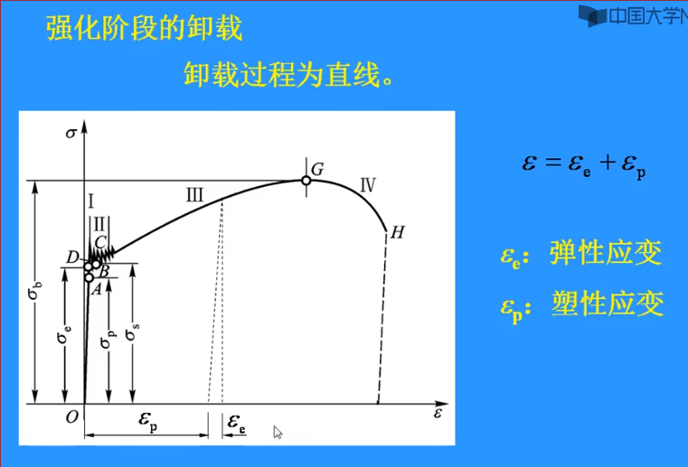

当强化阶段再加载时，会沿卸载路径上升直到卸载点，线性关系，因此比例极限提高`segma_p`，而`segma_b`不变, 材料的变形能力降低, 残余变形降低  *冷作硬化*

冷作时效：卸载后将试件放置较长时间后重新加载，会上升到之前的曲线之上，此时比例极限和强度极限均增加，而塑形以及残余变形依旧降低

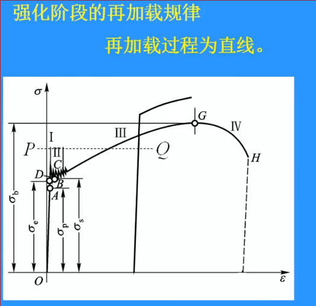

4. 过了G点后为局部变形阶段(破坏阶段)
 * 颈缩现象：横截面越来越细，最后怦然断裂形成杯状断口

### 塑形指标

* 伸长率 `delta = l_1 - l / l` 平均塑形伸长率 
    * `>5%`称为塑形材料 `<5%`称为脆性材料
* 断面收缩率 `psi = A - A_1 / A`

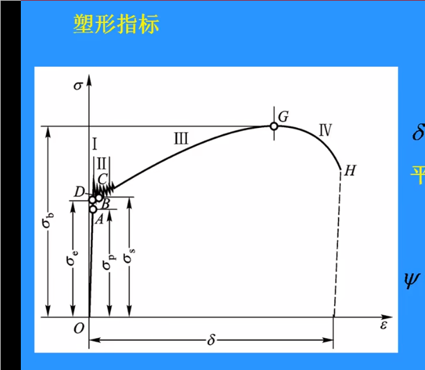

## 金属材料在压缩时的力学性能

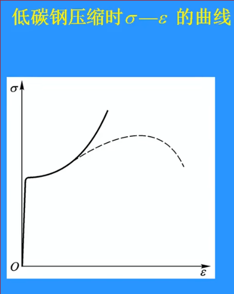

同样有线弹性阶段、屈服阶段、强化阶段，其中压缩时线弹性阶段和屈服阶段与拉伸时基本吻合

与拉伸时`segma_s 屈服极限`和`E 弹性模量`都基本相同

### 无屈服阶段的塑形材料

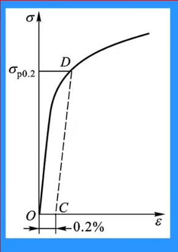

其屈服极限的确定：

1. 过横轴上应变为`0.2%`的点，作平行于线弹性阶段的直线，交曲线为D点
2. D点的纵坐标即为名义屈服极限 `segma_p0.2` 

### 灰口铸铁在拉伸时的segma-epsilon曲线

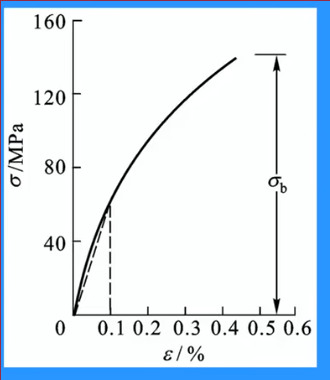

工程上使用曲线上应变为`0.1%`的点与原点连线的斜率计算弹性模量

铸铁的抗拉强度相对于低碳钢很低

铸铁的伸长率非常小，因此是典型的塑形材料

断口非常整齐

### 铸铁压缩时的segma-epsilon曲线

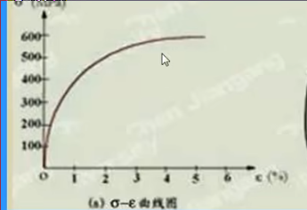

抗压强度很高

伸长率`delta`比拉伸大，超过塑形材料的阈值，因此铸铁具有两面性

压缩会发生破坏，为一个斜截面，其法线与轴线的夹角约为50-55度

## 安全系数、许用应力

许用应力 `[sigma]` = 能承受的极限应力 `segma_u` / 安全系数 `n` (>1)

极限应力 `segma_u`

* 对于脆性材料而言，没有塑形，以其强诉极限`segma_b`作为极限应力
* 对于塑形材料，以其发生塑形变形时，屈服极限`segma_s`或`segma_p0.2`

对于脆性材料 安全系数 n一般取到 `2.5-3.0` 甚至`4-14`
对于塑形材料 n一般取`1.25-2.5`
