# 扭转
 
* [扭矩、扭矩图](#扭矩、扭矩图)
  * [扭矩图](#扭矩图)
* [等直圆杆扭转时的应力](#等直圆杆扭转时的应力)
* [极惯性矩、扭转截面系数](#极惯性矩、扭转截面系数)
  * [实心圆](#实心圆)
  * [空心圆](#空心圆)
* [强度条件](#强度条件)
* [扭转的变形](#扭转的变形)
* [刚度条件](#刚度条件)
* [非圆截面杆受扭](#非圆截面杆受扭)
 
* [拉压变形的定义](#拉压变形的定义)
* [内力、截面法、轴力、轴力图](#内力、截面法、轴力、轴力图)
  * [内力_截面法_轴力](#内力_截面法_轴力)
  * [轴力图](#轴力图)
* [拉压杆的应力](#拉压杆的应力)
* [强度条件、安全系数、许用应力](#强度条件、安全系数、许用应力)
* [拉压杆的变形_胡克定律](#拉压杆的变形_胡克定律)
* [应变](#应变)
* [拉压杆的横向变形](#拉压杆的横向变形)
* [材料在拉伸和压缩时的力学性能](#材料在拉伸和压缩时的力学性能)
  * [低碳钢试样的拉伸图及其力学性能](#低碳钢试样的拉伸图及其力学性能)
  * [拉伸过程四个阶段的变形特征及应力特征点](#拉伸过程四个阶段的变形特征及应力特征点)
  * [塑形指标](#塑形指标)
* [金属材料在压缩时的力学性能](#金属材料在压缩时的力学性能)
  * [无屈服阶段的塑形材料](#无屈服阶段的塑形材料)
  * [灰口铸铁在拉伸时的segma-epsilon曲线](#灰口铸铁在拉伸时的segma-epsilon曲线)
  * [铸铁压缩时的segma-epsilon曲线](#铸铁压缩时的segma-epsilon曲线)
 
* [拉压变形的定义](##拉压变形的定义)
* [内力、截面法、轴力、轴力图](##内力、截面法、轴力、轴力图)
  * [内力_截面法_轴力](###内力_截面法_轴力)
  * [轴力图](###轴力图)
* [拉压杆的应力](##拉压杆的应力)
* [强度条件、安全系数、许用应力](##强度条件、安全系数、许用应力)
* [拉压杆的变形_胡克定律](##拉压杆的变形_胡克定律)
* [应变](##应变)
* [拉压杆的横向变形](##拉压杆的横向变形)
* [材料在拉伸和压缩时的力学性能](##材料在拉伸和压缩时的力学性能)
  * [低碳钢试样的拉伸图及其力学性能](###低碳钢试样的拉伸图及其力学性能)
  * [拉伸过程四个阶段的变形特征及应力特征点](###拉伸过程四个阶段的变形特征及应力特征点)
  * [塑形指标](###塑形指标)
* [金属材料在压缩时的力学性能](##金属材料在压缩时的力学性能)
  * [无屈服阶段的塑形材料](###无屈服阶段的塑形材料)
  * [灰口铸铁在拉伸时的segma-epsilon曲线](###灰口铸铁在拉伸时的segma-epsilon曲线)
  * [铸铁压缩时的segma-epsilon曲线](###铸铁压缩时的segma-epsilon曲线)

几何形状：等直圆杆 *允许分段等直 轴线要求为同一条*

受力特点：大小相等，方向相反，作用面垂直于杆的轴线的力偶

变形特点：横截面绕轴心转动，杆表面上的纵向线变成螺旋线

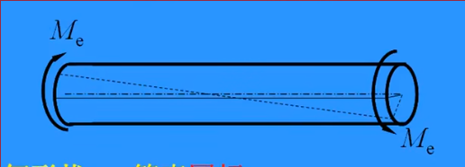

轴上外力力偶的计算

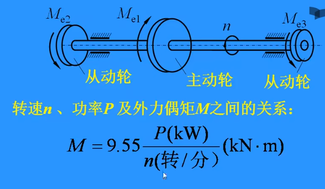

* 主动轮上外力偶的转向与传动轴转向相同
* 从动轮上外力偶的转向与传动轴转向相反
* 主动轮的总功率与从动轮总功率相同
* 主动论力矩与从动轮总力矩相等

## 扭矩、扭矩图

1. 画工作简图

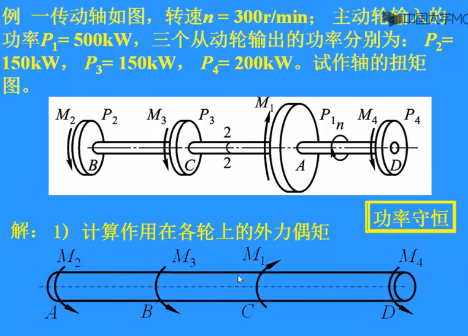

2. 算出各轮作用力偶

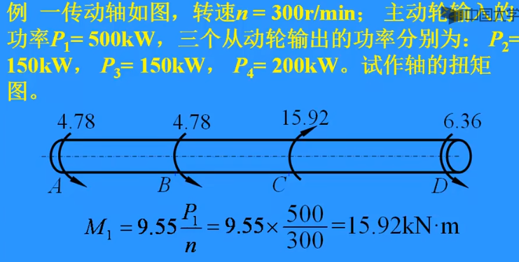

3. 对各段使用截面法确定扭矩（内力偶）

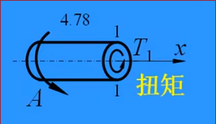

4. 列平衡方程，确定扭矩的大小和方向

扭矩的符号：**以力偶矢离开截面为正** *右手四值弯向力偶旋转方向，拇指方向*

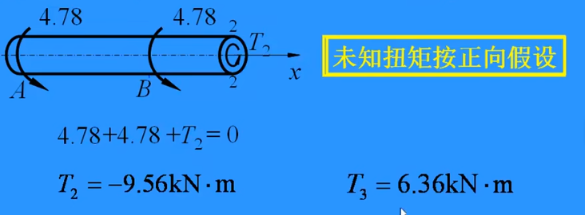

### 扭矩图

横坐标平行于轴线，与轴对应，纵坐标表示扭矩`T` KN*m

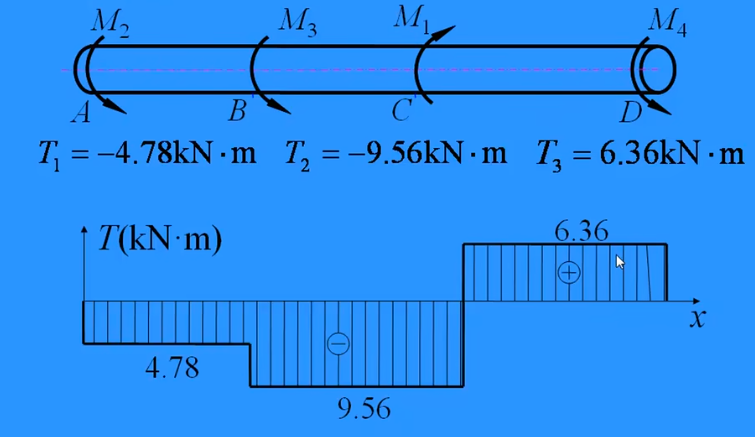

同样数值不标正负，阴影线标

## 等直圆杆扭转时的应力

平面假设：等直圆杆受扭转时，其横截面如同刚性平面一样绕杆的轴向转动

横截面上没有正应力

只有作用在横截面内的切应力`tau`

横截面内的切应力总与半径垂直，并且离圆心越远，切应力越大（与半径成正比），圆心处切应力为0

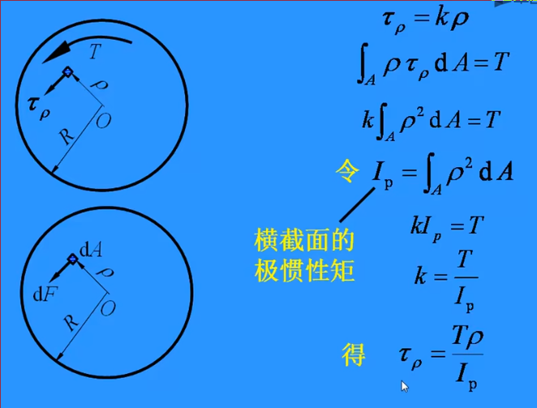

* 切应力与半径垂直，并且与扭矩同向
* 沿半径三角形分布
* 圆心处切应力为0
* 外圆周处切应力最大 `tau_max = TR / I_p = T / W_p` `W_p = T_p / R 扭转截面系数`

## 极惯性矩、扭转截面系数

### 实心圆

极惯性矩 `I_p = 积分pho^edA = pi*d^4/32`

扭转截面系数 `W_p = I_p / (d/2) = pi*d^3/16`

### 空心圆

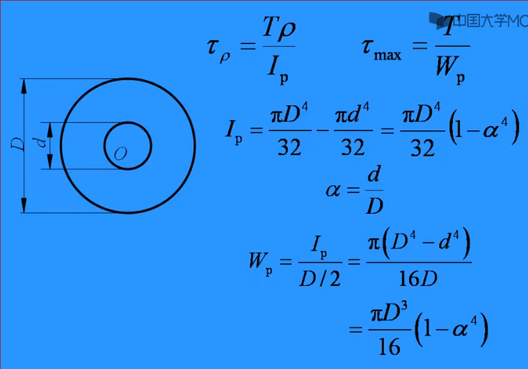

## 强度条件

`tau_max 可以承受的最大切应力 <= [tau] 许用切应力`

等直圆周 `T_max最大扭矩 / W_p <= [tau]`

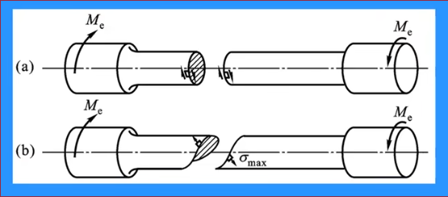

前者是低碳钢的扭转断口 后者是铸铁的扭转断口（由于其抗拉强度低，先被拉断）

## 扭转的变形

假设左端面不动，其余各横截面相对左端面转动，右端面转动幅度最大，以这两个截面的相对扭转角`psi`作为其变形

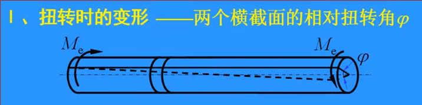

对于每个微段的相对扭转角dpsi

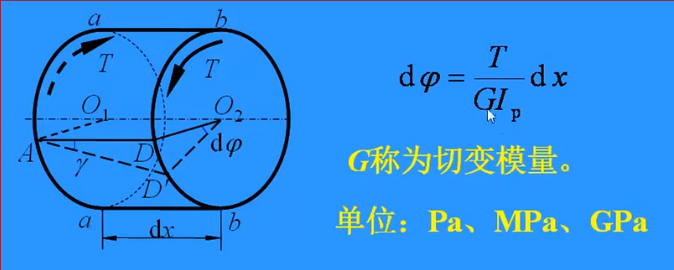

因此整个轴的扭转角为

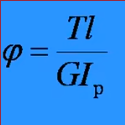

称为扭转胡克定律 `GI_p`称为扭转刚度 *抵抗扭转变形的能力*

* 适用于线弹性范围
* 计算长度内 `T G I_p`均为常量

## 刚度条件

`pis_max <= [psi]`

但是转角和长度还有关

因此定义单位长度的扭转角 `psi'_max = psi_max / l = T_max / GI_p * 180 / pi <= [psi']` 单位为 度/米

## 非圆截面杆受扭

横截面发生翘曲，不满足平面假设

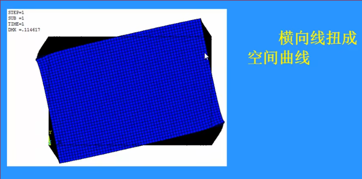

* 等直杆两端受 外力偶作用 可自由翘曲 **自由扭转 纯扭转**
    * 此时相邻两横截面的翘曲程度完全相同，无附加正应力产生
* 不能自由翘曲，受到约束 **约束扭转**
    * 此时相邻两横截面的翘曲程度不同，横截面上有附加正应力发生

### 矩形截面杆自由扭转时，应力分布

此时只有切应力

当 `tau <= tau_p 比例极限` 

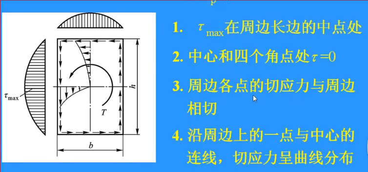

* `tau_max` 在周边长边的中点处
* 中心和四个角点处切应力为0
* 周边各点的切应力与周边相切
* 沿周边上一点与中心连线上，切应力曲线分布
