# 弯曲应力
 
* [剪力_弯矩_剪力图_弯矩图](#剪力_弯矩_剪力图_弯矩图)
  * [剪力和弯矩的符号](#剪力和弯矩的符号)
  * [剪力图_弯矩图](#剪力图_弯矩图)
* [弯矩_剪力_与分布载荷的关系及应用](#弯矩_剪力_与分布载荷的关系及应用)
  * [剪力和分布载荷的关系](#剪力和分布载荷的关系)
  * [弯矩和剪力的关系](#弯矩和剪力的关系)
* [快速画出剪力图_弯矩图](#快速画出剪力图_弯矩图)
* [平面钢架和曲杆的内力图](#平面钢架和曲杆的内力图)
* [曲杆的内力](#曲杆的内力)
* [梁横截面上的正应力](#梁横截面上的正应力)
  * [纯弯曲时梁横截面上的正应力](#纯弯曲时梁横截面上的正应力)
  * [如何得到弯曲正应力呢](#如何得到弯曲正应力呢)
 

几何特点：等直杆

受力特点：杆件受到垂直于杆轴线的外力（横向力）或外力偶（其矢量垂直于杆轴）作用

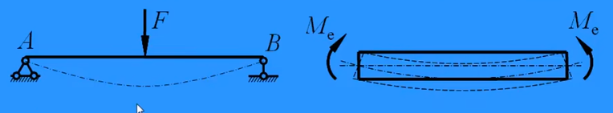

变形特点：

* 直杆的轴线变形后变成曲线
* 任意两横截面绕垂直于杆轴的轴作相对转动 

## 剪力_弯矩_剪力图_弯矩图

简支梁：一端固定铰支座，一端活动铰支座

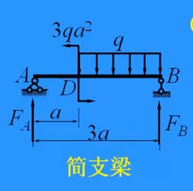

1. 求反力

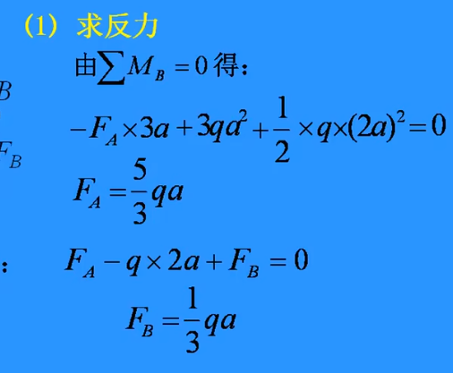

2. 截面法求截面内力

受到一个竖直的剪力（`F_s`)以及一个逆时针的力偶（弯矩`M`）

### 剪力和弯矩的符号

当剪力单独作用与钉在墙上的分离体时，使得分离体顺时针转动为正 逆时针为负

当弯矩单独作用与另一端固定在墙上的分离体时，使得分离体下表面绷紧，上表面挤压为正

### 剪力图_弯矩图

对于弯矩图M-x，一般水平方向的M轴向下

对于二次曲线 **两个端点** **凹凸性** **是否有零点**

* 注意要标注**极值**

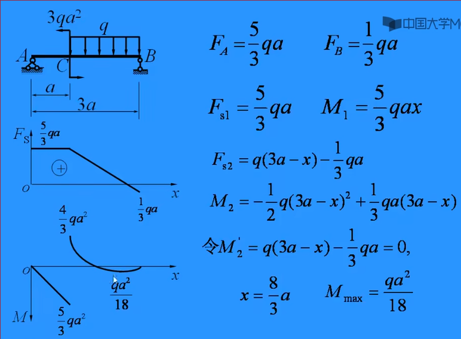

## 弯矩_剪力_与分布载荷的关系及应用

之前通过受力平衡的方式求弯矩和剪力，现在欲得到可以简化计算的方法

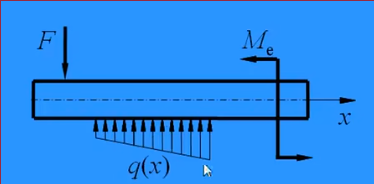

* 分布负载集度的方向以向上为正，向下为负，如图所示即为负的

### 剪力和分布载荷的关系

微分关系 **梁上剪力函数`F_S(x)`的导数即为梁上分布载荷集度函数q(x)**

对微分关系进一步推导可得：

`F_Sx2` - `F_Sx1` = `S_q` **后一个截面上的剪力为前一个截面的剪力加上中间分布载荷的合力**

### 弯矩和剪力的关系

微分关系 **弯矩函数`M(x)`的导数为剪力函数`F_s(x)`** 

由积分可得 **后一个截面上的弯矩为前一个截面的弯矩加上两截面间剪力图的面积**

因此弯矩和分布载荷集度有二阶导的关系

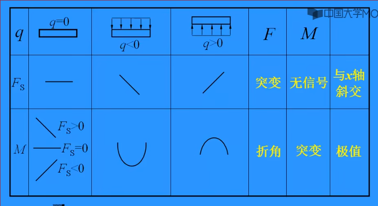

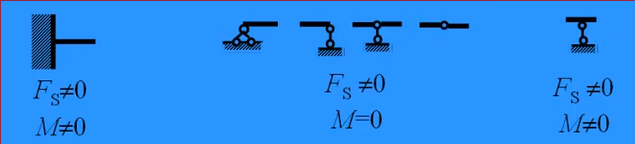

## 快速画出剪力图_弯矩图

从左往右根据**表中**和**结论**进行

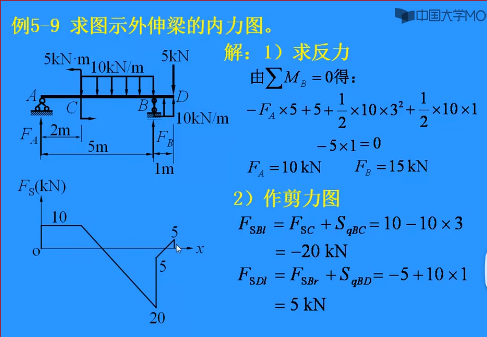

**集中力偶引起的弯矩图突变**

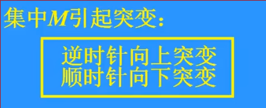

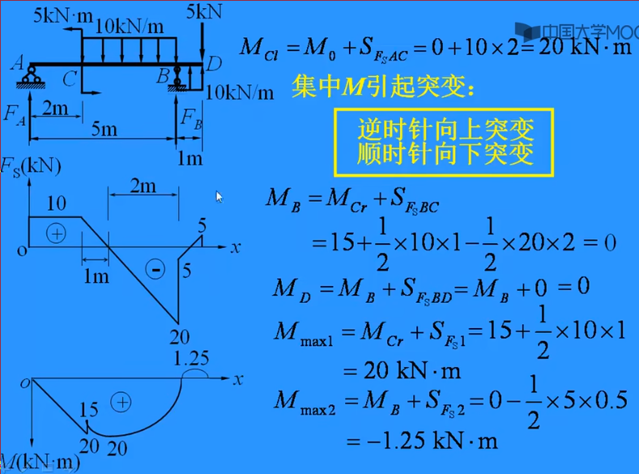

## 平面钢架和曲杆的内力图

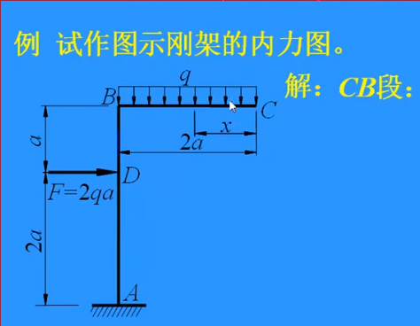

首先去分离体受力分析 对于刚体，一般先假设三种力：轴力 剪力 弯矩

对于竖直杆，由于没有下表面，其弯矩正方向任意假设

钢架的轴力、剪力按照形状画好，其竖直方向的图可任意画在一侧，标注符号

弯矩图画在受拉侧

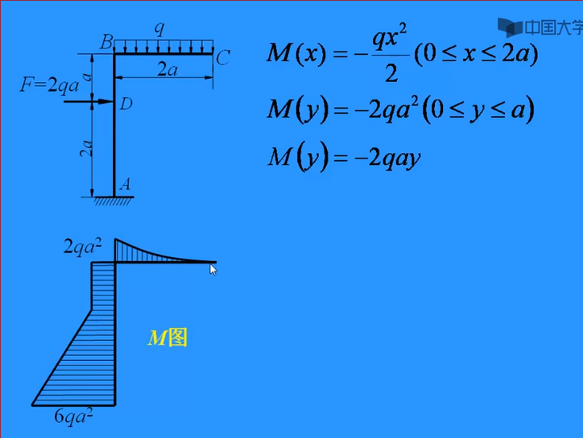

## 曲杆的内力

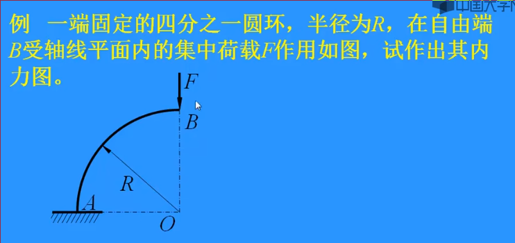

在列平衡方程时，用某一点切向和法向的两个力平衡方程，代替水平和竖直的两个方程

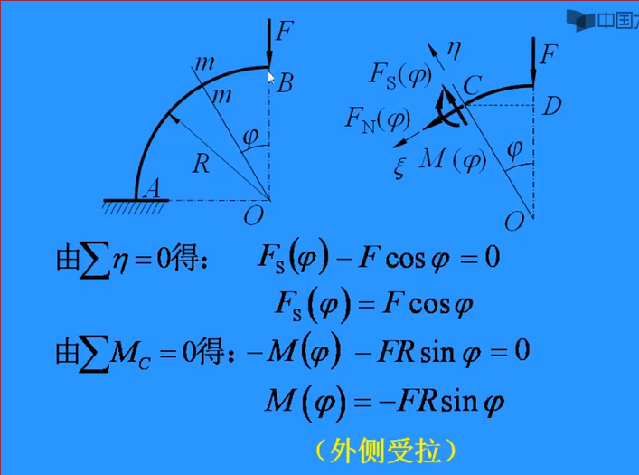

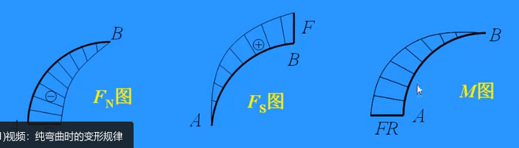

## 梁横截面上的正应力

剪力和弯矩在横截面上每个点匀得的力为应力

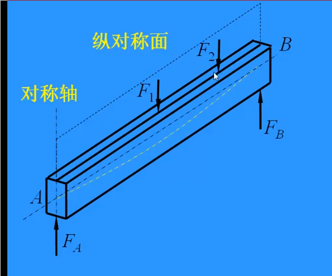

平面弯曲：所有力和力偶作用于梁的纵向对称平面, 梁变形后的轴线为**在纵向对称平面内的一条平面曲线**

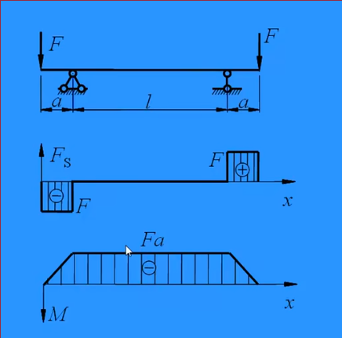

在梁的中间部分，剪力为0,弯矩为常量，称这种弯曲为**纯弯曲**

在梁的两侧，剪力和弯矩都不为0，称这种弯曲为**横力弯曲**

### 纯弯曲时梁横截面上的正应力

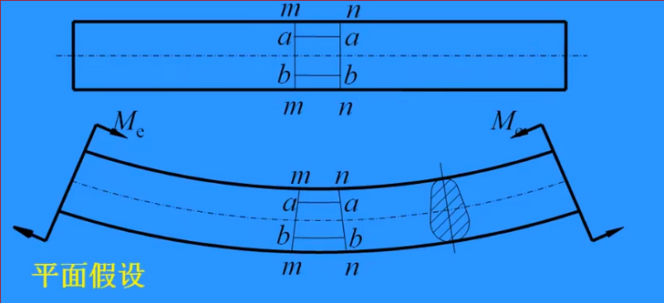

平面假设：梁在纯弯曲时，横截面仍为平面，且与梁变形后的轴线仍保持正交，只是绕垂直于纵向对称平面的某一轴转动

纵向线(变弯)和横向线(变斜)仍垂直 因此无切应变 切应力为0

因此只需要研究正应力，假设正应力沿横截面宽度方向均匀分布

梁的上表面受压最严重，下表面受拉最严重，中间存在一个**既不受拉，又不受压的面**， 称为**中性层**， 其与横截面的交线为**中性轴**， 中性层分梁为**受拉区**和**受压区**

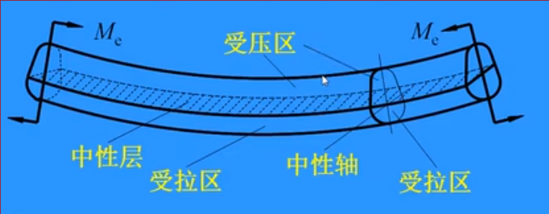

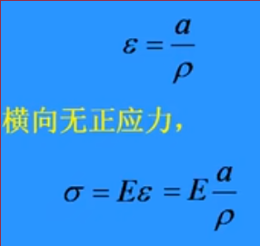

其中 a为距离中心层的距离 pho为 中心层的曲率半径

上方为切应力

下方为弯曲正应力

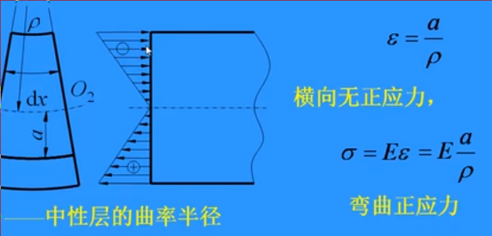

### 如何得到弯曲正应力呢

