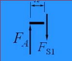

# 弯曲应力

几何特点：等直杆

受力特点：杆件受到垂直于杆轴线的外力（横向力）或外力偶（其矢量垂直于杆轴）作用

变形特点：

* 直杆的轴线变形后变成曲线
* 任意两横截面绕垂直于杆轴的轴作相对转动 

## 剪力、弯矩、剪力图、弯矩图

简支梁：一端固定铰支座，一端活动铰支座

1. 求反力

2. 截面法求截面内力

受到一个竖直的剪力（`F_s`)以及一个逆时针的力偶（弯矩`M`）

### 剪力和弯矩的符号

当剪力单独作用与钉在墙上的分离体时，使得分离体顺时针转动为正 逆时针为负

当弯矩单独作用与另一端固定在墙上的分离体时，使得分离体下表面绷紧，上表面挤压为正

### 剪力图、弯矩图

