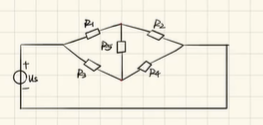
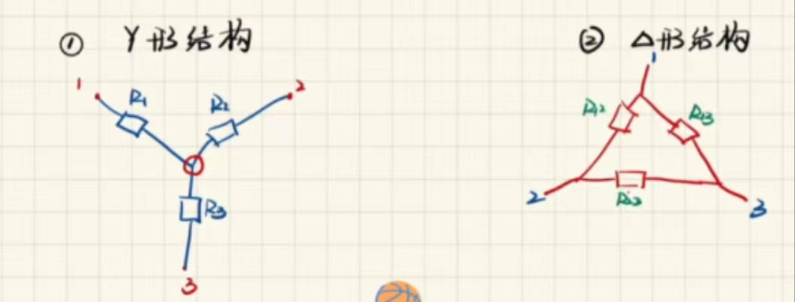
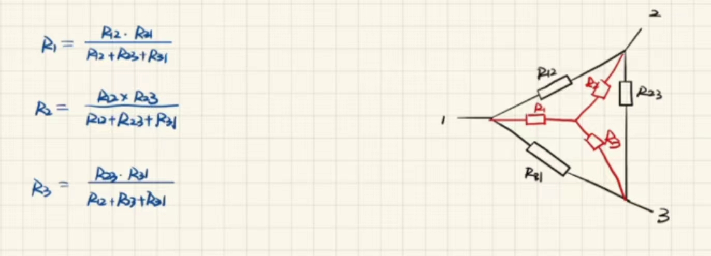
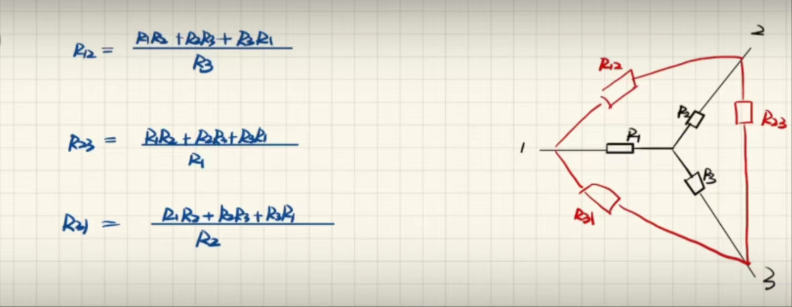
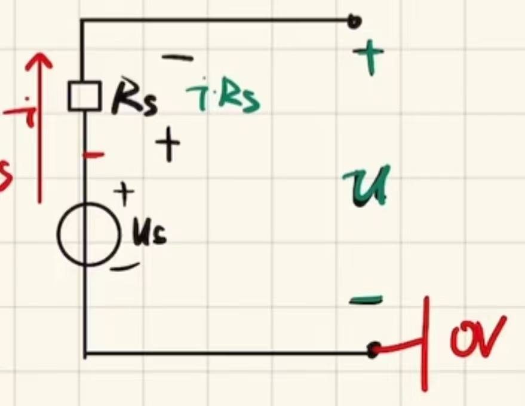
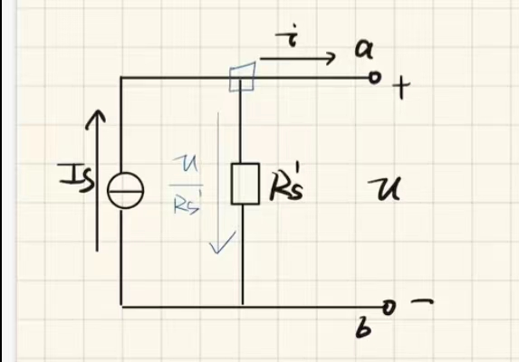
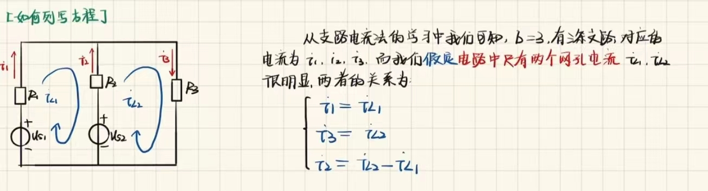
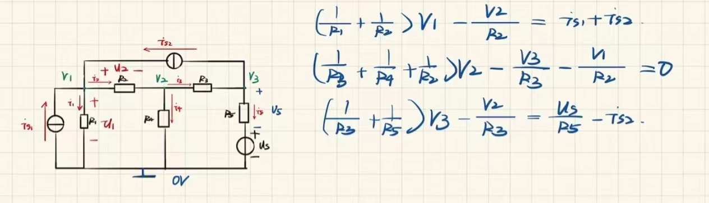

# 电路原理

---

[课程地址]([https://www.bilibili.com/video/BV1Lb4y1m7vD/?p=9&spm_id_from=333.1007.top_right_bar_window_history.content.click] "up主 老游真是太菜了 BV1uW4y1v7xr") 
https://www.bilibili.com/video/BV1Lb4y1m7vD/?p=9&spm_id_from=333.1007.top_right_bar_window_history.content.click

## 第一章 电路模型和电路定律

---

**重点**

*电压和电流的参考方向*

*电阻元件和电源元件的特性*

*基尔霍夫定律*

### 1.1电路和电路模型

---

**实际电路** 电工设备和电气器件连接-通路

**电路模型** 反应实际电路的主要电磁性质-**理想**电路元件组合 

**理想电路元件** 具有理想电磁性质的电路元件

**五种基本电路元件**

* 电阻元件 消耗电能的元件
* 电感元件 产生磁场 储存磁场能量的元件
* 电容元件 产生电场 储存电容能量的元件
* 电压源和电流源 其他形式能转化为电能

**五种基本电路元件特征**

* 只有两个端子
* 可用电压或电流按数学方式描述 如$U = RI$
* 不能被分解为其他元件

**注意**

* 具有相同主要电磁性能的**实际**电路部件，在一定条件可用同一**电路模型**表示 如 小灯泡是纯电阻的元件 可表示为电阻
* 同一**实际**电路部件在不同应用条件，其**电路模型**可有不同形式 如 电感线圈有时可以表示为纯电阻 有时可以表示为电感 电阻 电容组合

### 1.2 电流和电压的参考方向

---

**电流** 带电粒子有规律的定向运动

**电流强度** **单位时间内**($1s$)通过**导体横截面**的**电荷量**($C$)

* $I = Q / T$  
* 单位 $A $
* 方向 规定**正电荷**运动方向为电流的实际方向
* 对于电流大小和方向随时间变化的复杂电路，难以判断电流的方向，引入**参考方向**

**电流的参考方向** 任意**假定**一个正电荷运动的方向为电流的参考方向（*理解:正方向*）

* 当实际方向与参考方向相同，规定电流为正值
* 参考方向的表示方法1: 用箭头，箭头的指向为电流的参考方向
* 参考方向的表示方法2:用下标，$i$~A~~B~ 表示电流的参考方向由A到B

**电位** **单位正电荷**q在电场力作用下，从电路中A点，移到参考点($\varPhi = 0$)时**电场力做功**的大小叫A点的电位

**电压** **单位正电荷**q在电场力作用下，从电路中一点移到另一点时**电场力做功**(*W*)的大小

* $U$~A~~B~ $= W / Q = \varPhi$~A~ ($\varPhi$~B~ $= 0$)
* 单位 $V$
* 实际电压方向 **电位真正降低**的方向
* 电压具有**绝对性** 电位具有**相对性**
* 对于电压大小和方向随时间变化的复杂电路，难以判断电压的方向，引入**参考方向**

**电压的参考方向** **假定**高电位指向低电位的方向

* 当实际方向与参考方向相同，规定电压为正值
* 参考方向的表示方法1:用箭头(*不好，易与电流参考方向箭头混淆*)
* 参考方向的表示方向2:用正负极（*主要运用*） **由正极指向负极**
* 参考方向的表示方法3:用下标 $U$~A~~B~电压由A指向B

**关联参考方向** 元件或支路的$u,i$采用**相同的参考方向**称之为关联参考方向。反之称为非关联参考方向

**注意** 

* 分析电路的第一件事就是要**选定电流和电压的参考方向**
* 参考方向一经选定，**必须在相应位置标注，在计算过程不得任意改变**
* 选定的参考方向不同时，其表达式相差一符号，但电流电压的实际方向不变 $U = RI ，U = -RI$

### 1.3 电功率和能量

---

**电功率** **单位时间**内电场力所做的功

* $ P = W / T = (W / Q) (Q / T) = UI$
* 单位 $W$(*瓦*)

**电路吸收或发出功率的判断**

* 吸收功率:吸收能量 如 电灯
* 发出功率:发出能量

*判断方法*

* $u，i$取关联参考方向 - $P$表示吸收功率
  当P的值为正 表示吸收正功率（实际吸收）
  当p的值为负 表示吸收负功率（实际发出）
* $u，i$取非关联参考方向 - $p$表示发出功率
  当P的值为正 表示发出正功率（实际发出）
  当p的值为负 表示发出负功率（实际吸收）

***完整电路中吸收和发出功率相等***

### 1.4 电路元件

---

**电路元件** 电路中最基本的单元

*5种基本理想电路元件* 请参考[1.1电路和电路模型](#11电路和电路模型)

### 1.5 电阻元件

---

**电阻元件** 对电流呈现阻力的元件。其特性可用$u$-$i$平面上一条曲线$f(u,i) = 0$表示

**线性时不变电阻元件** 任何时刻**端电压与电流成正比**的电阻元件 *R不变*

*端电压* 电阻两端的电压

* 欧姆定律 $R = U / I , i = u / R = G u$ **关联参考方向**
  $G$:电导 $G = 1 / R$ 单位 (*$s$西门子*)

**注意**

* 欧姆定律只适合于**线性电阻**
* 如果电阻上的电压和电流参考方向**非关联，公式(欧姆定律)要冠以负号**
* 欧姆定律说明线性电阻是**无记忆，双向性的元件**

**功率和能量**

* $P = UI = I$^2^$R = u$^2^ $/ R$

*电阻元件在任何时刻总是消耗功率的*

**电阻的开路和断路**

* 开路
  $i = 0$
  $u \ne 0$ 
  $R \rightarrow +\infty$ , $G \rightarrow 0$
* 短路
  $i \ne 0$
  $u = 0$
  $R = 0 , G \rightarrow +\infty$

### 1.6 电压源和电流源

---

**理想电压源**

* 其两端电压总能**保持定值**或一定的时间函数，其值**与流过它的电流$i$无关**的元件(*理解:向外电路输出定值电压*)
* **两端电压**由电源本身决定，**与外电路无关**，**与流经它的电流大小方向无关**
* 通过电压源的**电流由电源及外电路共同决定**

*电压源不可以短路*

**电压源的功率** $P = U$~s~$i$

* 电压电流参考方向非关联
  正电荷在外力作用下由低电位向高电位移动，外力克服电场力做功，电源**发出功率**
* 电压电源参考方向关联
  电场力做功，电源**吸收功率**，充当负载(如充电宝)

**理想电流源** 

* 其两端电流总能**保持定值**或一定的时间函数，其值**与它两端的电压$u$无关**的元件(*理解:向外电路输出定值电流*)
* **输出电流**由电源本身决定，**与外电路无关**，**与它两端的电压大小，方向无关**
* 电流源两端的**电压由电源及外电路共同决定**

*电流源不可以断路*

**电流源的功率** $P = ui$~s~

### 1.7 受控电源

---

**定义** 电压或电流的大小和方向**不是给定的时间函数**，而是受**电路中某个地方的电压（或电流）控制**的电源

**分类**

*四端元件 分为**输入:控制部分**和**输出:受控部分***

* 电流控制的电流源 （*CCCS*）*流控电流源* $i$~2~ $=\beta i$~1~ （$\beta$ 电流放大倍数） 
* 电压控制的电流源 （*VCCS*）$i$~2~$=gu$~1~ （$g$ 转移电导）
* 电压控制的电压源 （*VCVS*）$u$~2~$=\mu u$~1~ （$\mu $ 电压放大倍数）
* 电流控制的电压源 (*CCVS*) $u$~2~$=ri$~1~ （$r$ 转移电阻）

**受控源和独立源比较**

* 独立源电压(电流)**由电源本身决定，与电路中其他电压电流无关**，而受控源电压（电流）**由控制量决定**
* 独立源在电路中起**激励**作用，在电路中产生电流，电压，而受控源**反映电路中某处的电压或电流对另一处电流电压的控制**，在电路中不能作为激励

### 1.8 基尔霍夫定律

---

*分为基尔霍夫电流定律(KCL)和基尔霍夫电压定率(KVL)*

*反映电路中所有支路电压和电流遵循的基本规律，是分析集总参数电路的基本定理*

*它与元件特性构成电路分析的基础*

**支路** $b$

* 定义1 电路中每个**两端元件**就叫一条支路
* 定义2 电路中通过**同一电流**的分支（**常用**）

**结点/节点** $n$
* 定义1 **元件的连接点**称为结点
* 定义2 **三条或三条以上**支路的连接点（**常用**）

**路径** **两节点间的一条通路**，由支路构成

**回路** 由支路构成的**闭合路径** $l$

**网孔** 对与平面电路，其**内部**不含任何支路的回路称网孔 $m$

*网孔是回路，回路不一定是网孔*

***基尔霍夫电流定律*** *KCL*

在集总参数电路中，任意时刻，对**任意结点流出**(或流入)该结点电流的**代数和**等于$0$

*从节点流出的电流等于流入的电流*

*此节点可以延伸至广义节点(将闭合面看成节点 流出闭合面电流为0)* 

**广义节点** 电路中包围多个节点的任意闭合面

**注意** 

* KCL是**电荷守恒和电流连续性原理**在电路中任意节点处的反映
* KCL是对节点处电流加的约束，**与支路上接的是什么元件开关，与电路是线性非线性无关**
* KCL方程是**按电流参考方向**列写的，与电流实际方向无关

***基尔霍夫电压定律*** *KVL*

在集总参数电路中，任一时刻，**沿任一回路**，所有支路电压的**代数和**恒等于$0$

*步骤*

1. 标定各元件电压参考方向
2. 选定回路绕行方向 顺/逆
3. 根据绕行方向与参考方向正反 列方程

**注意**

* KVL反映电路遵循**能量守恒**
* KVL是对回路中的支路电压加的约束，**与回路中各支路上接的什么元件无关，与电路是线性还是非线性无关**
* KVL方程是**按电压参考方向列写的**，与电压实际方向无关

## 第二章 电阻电路的等效变换

---

**重点**

*电路等效的概念*

*电阻的串并联*

*电阻的$Y$-$\Delta$变换*

*电压源和电流源的等效变换*

### 2.1 引言

---

**电阻电路** 仅由电源和线性电阻构成的电路

**分析方法** 

* **欧姆定律**和**基尔霍夫定律**是分析电阻电路的依据
* **等效变换**的方法（*化简*）

### 2.2 电路的等效变换

---

**两端电路/两端网络** 任何一个**复杂的电路，向外引出两个端钮**，且**从一个端子流入的电流等于从另一端子流出的电流**，称这一电路为二端网络（一端口网络）

**无源一端口网络** **不含电源**的二端网络

**两端电路等效** 

* 两个**二端网络**，端口具有**相同的电压，电流关系**，则称它们是等效的电路
* *相同电压，电流关系 **相同电压，电流参考方向**下，两端子电压数值相同，端子上电流**数值相同*** 
* *等效的两端网络，**对外电路**的电流，电压，功率完全相同*
* ***对外等效***

**明确**

* 电路等效的条件 两电路具有**相同VCR**
* 电路等效变换的对象 **未变化的外电路**A中的电压，电流和功率（**对外等效，对内不等效**）
* 电路等效的目的 化简电路，**方便计算**

### 2.3 电阻的串并联

---

**电阻的串联**

* 串联电路电流相等
* 总电阻等于分电阻之和
* 总电压等于分电压之和
* **电压之比等于电阻之比**

**电阻的并联**

* 并联电路电压相等
* 并联电路总电流等于分电流之和
* 两个电阻总电阻 *积在和上飞（适用两个电阻）*
* 多个电阻总电阻 $\rightarrow$ *总电导等于分电导之和
* ***电流之比为电阻的反比***

#### 2.3.1 电阻的混联及处理等效电阻等效的思路及方法

___

**电阻的混联** 在电路中包含了复杂的串联，并联

**方法**

* **理解:判断并联法**
  *头电压是同一个，尾电压是同一个则为并联，合一起之后，任意一路断掉*
  *在并联的两路的某一路上有多个电阻（始终是同一支路），则为串联，合一起之后，电阻去掉但路不断*
* 标点法
  *判断并联法的表现形式*
* **电桥平衡**
  *当$R$~1~ $*$ $R$~4~ $=$ $R$~2~ $*$ $R$~3~时*
  *可将$R$~5~短路或断路*

* **以经验为主削减电路，简化电路结构** *首选*
  *判断并联法的表现形式*
  *不仅可以从里向外正推，也可以外向里反推*

### 2.4 电阻的Y（星）型连接及$\Delta$型连接及其等效变换

---

**处理方法** *星三角转换* 

* 从三角形转成星（Y）形 *积在和上飞2.0* **优先考虑**

*一些特殊情况* 三角的**三个电阻阻值相同**，则化为星每个电阻是原电阻$1/3$

*不平衡的电桥用此方法解决*

* 从星形转成三角形 *积合在单上*

### 2.5 电压源与电流源的串联与并联

---

**理想电压源的串联与并联**

* 理想电压源之间的**串联可以等效**，等效的电压源电压等于所有电压源电压的代数和

* 理想电压源之间的**并联需要数值和方向相同**,等效的电源和一个电源数值方向相同

**理想电流源的串联与并联**

* 理想电流源之间的**并联可以等效**，等效的电流源电流等于所有电流源电流的代数和
  
* 理想电流源之间的**串联需要数值和方向相同**，等效的的电源和一个电源数值方向相同

### 2.6 实际电源的两种模型及其等效变换

---

**实际电压源**

*由于内阻影响压力输出，可简化为如图所示的**串联分压**模型*

*端口电压电流的伏安特性曲线*

$u$ $=$ $u$~s~ $-$ $iR$~s~

**理想电流源**

*由于内阻影响电流输出，可简化为如图所示的**并联分流**模型*

*端口电压电流的伏安特性曲线*

$i$ $=$ $I$~s~ $-$ $u/R$~s~

**与理想电流/电压源相关的等效重要结论**

* 任何**元件与电流源串联**时，当**研究外电路**时，这个元件**可短**，该元件仅影响电流源两端的电压，进而影响电流源的功率
* 任何**元件与电压源并联**时，当**研究外电路**时，这个元件**可断**，该元件仅影响电压源支路的电流，进而影响电压源的功率

***实际电压源与电流源的相互等效*** *对外*

**相互转换的条件**

1. 两种实际电源的**内阻相等**
2. 电压源$u$~s~与电流源$I$~s~满足条件 **$u$~s~ $=$ $I$~s~ $*$ $R$~s~**
3. 两种电源模型**流出电流方向相同**（*注意在电源内部从$-$向$+$流*）

### 2.7 输入电阻

---

**定义** 

* 定义1 若一个端口内部**仅含电阻**，则应用电阻的串并联，Y-$\Delta$转换等方法，**求得的等效电阻**，即为这个端口的输入电阻 $R_i=\dfrac{u}{i}$
* **定义2** 若内部除电阻以外还含有受控源，但**不含独立电源**，则无论内部多复杂，则电压、电流法求输入电阻，即在**端口加电压源，求得电流**，或**在端口加电流源，求得电压**，得其**比值** $R_i=\dfrac{u}{i}$

*若含有独立电源，将电流源断路，电压源短路*

*在求复杂端口的输入电阻时，可以先求出其中简单端口的输入电阻，简单端口等效成求得的输入电阻再继续求*

## 第三章

### 3.1 支路电流法

---

***支路*** 电路中通过同一电流的分支 branch b
***结点*** 三条或三条以上的支路相交的电 node n
**路径** 两个结点之间的通路
***回路*** 由路径组成的闭合路径 loop l
**网孔** 内部不包含其它支路的回路 mesh m

**支路电流法** 

* 定义 以**各支路电流**为未知量列写电路方程*KCL，KVL*分析电路的方法
* 核心 对于有**b条支路**的电路，即有**b个电流**作为未知量，列写**b个*独立*方程**，再进行求解

*n个KCL方程中，只有n-1个独立方程*
*故只任意列写**所有结点数-1个KCL方程***

*所有KVL方程中，只有网孔的KVL方程独立*
*故只列写**网孔的KVL方程***
*当网孔有**难以列得电压的电流源**，可以绕开，选择适当的回路*
### 3.2 网孔电流法

---

**网孔电流法**

* 定义 从**沿网孔连续流动的假想电流**为未知量列写电路方程*KVL*分析电路的方法
* 基本思想 为减少未知量的个数，**假想**每个网孔中有一个回路电流。**实际的各支路电流与假想的网孔电流满足一定的线性关系如下图**，进而求得电路的解

*每个实际电流和网孔假想电流的关系*

*列KVL时*

* 将$R_1+R_2$即为$R_{11}$,为网孔1的自电阻
* 将$R_2+R_3$即为$R_{22}$,为网孔2的自电阻
* 而$R_2$为网孔1，2的共有电阻，称为互电阻。我们发现，当**网孔电流绕行方向一致**时（同为顺逆时针），互电阻方向取反

*假想绕行电流$*$自电阻$-$互电阻另一端假想绕行电流$*$互电阻$=$电压源电压升高值*

*当遇到网孔中含**电流源**时，假想网孔电流可以直接得出**等于电流源的电流***

### 3.3 结点电压法

---

**结点电压法** 

* 定义 以**结点上的电位(电压)** 为未知量，列写电流方程*KCL*分析电路的方法，**适用于结点数较少的电路**
* 基本思路 以选取的结点上的电压为未知量，**KVL自动满足**，而各支路的电流可根据设好的电位为未知量，通过欧姆定律表示出来，故只需要列写KCL方程

**注意事项**

* 与支路电流法相比，少了m个KVL方程
* 以**电位**为未知量，必须有**参考点**

**步骤**

1. 找到电路中**除参考点外的所有节点**
2. 令它们的**电位**分别为$V_1,V_2,V_3$
3. **针对结点**列写*KCL*方程
4. 以**电位为未知量**通过**欧姆定理**代入*KCL*方程中
5. 整理方程

*列KCL时*

* $G_{11}=G_1+G_2=\dfrac{1}{R_1}+\dfrac{1}{R_2}$称为结点1的自电导
* $G_{22}=G_2+G_3+G_4=\dfrac{1}{R_2}+\dfrac{1}{R_3}+\dfrac{1}{R_4}$称为结点2的自电导
* $G_{33}=G_3+G_5=\dfrac{1}{R_3}+\dfrac{1}{R_5}$称为结点3的自电导
* $G_{12}=G_{21}=\dfrac{1}{R_2}$为节点12的共有电导，称为互电导
* $G_{23}=G_{32}=\dfrac{1}{R_3}$为节点23的共有电导，称为互电导

*节点电压$*$自电导$-$互电导另一端节点电压$*$互电导$=$电流源流入电流*

*节点连接的支路有**电压源***

* 若其与电阻串联，尝试转为电流源
* 若其单独存在，利用电位关系减少未知量

*节点连接的支路有**电流源***

* **若其与电阻串联，利用电流源的等效，将电阻短路**

### 3.4 回路电流法

---

**回路电流法** 以**基本回路中沿回路连续流动的假想电流**为未知量列写电路方程*KVL*分析电路的方法 *其原理与网孔电流法大致相同*

**步骤** 

1. 选择**网孔数个回路**，并确定绕行方向
2. 对这些回路，以**回路上的假想电流**为未知量，列写*KVl*方程
3. 求解方程，进一步进行相关计算

**特点**

* 通过**灵活选取回路**设定回路电流可以减少计算量
* 互电阻的**识别难度大** *比网孔电流法更灵活，但列写难度更大*

*假想绕行电流$*$自电阻 **$\pm$** 互电阻另一端假想绕行电流$*$互电阻$=$电压源电压升高值*

* 当通过互电阻电流方向相同 $+$
* 当通过互电阻电流方向相反 $-$

*使得互电阻处不含电流源*

*更新至 第一章-第三章 习题复习1*

