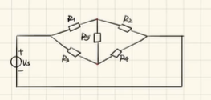
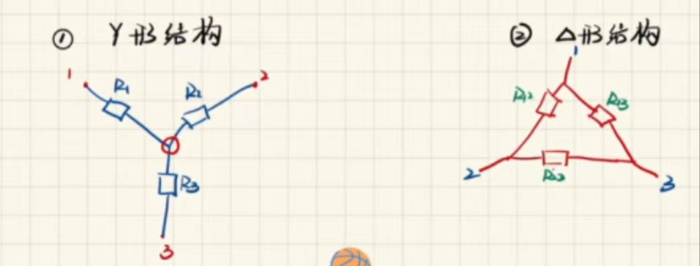
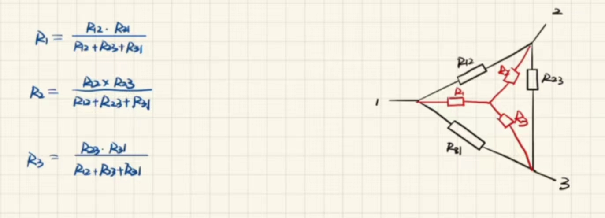
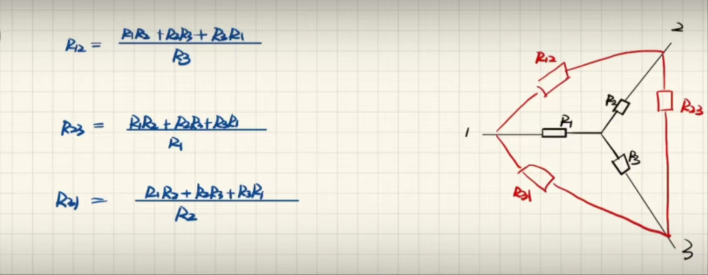
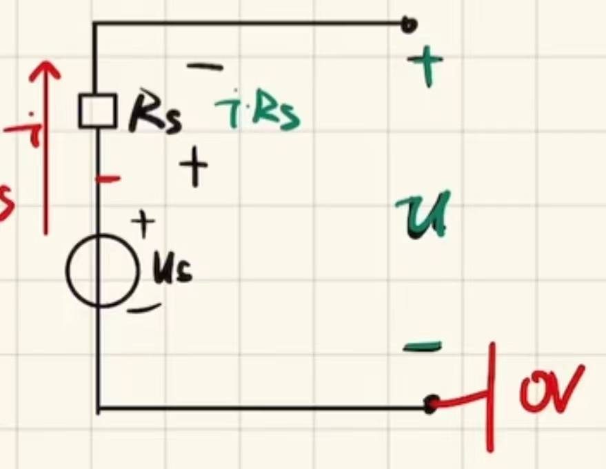
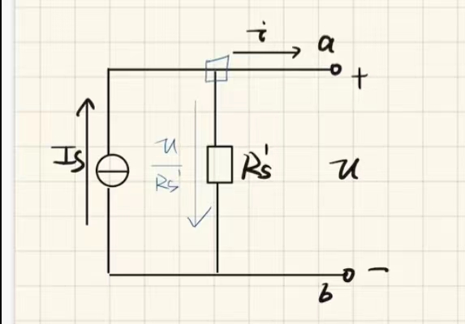

# 第二章_电阻电路的等效变换
 
* [2.1_引言](#2.1_引言)
* [2.2_电路的等效变换](#2.2_电路的等效变换)
* [2.3_电阻的串并联](#2.3_电阻的串并联)
  * [2.3.1_电阻的混联及处理等效电阻等效的思路及方法](#2.3.1_电阻的混联及处理等效电阻等效的思路及方法)
* [2.4_电阻的Y（星）型连接及$\Delta$型连接及其等效变换](#2.4_电阻的Y（星）型连接及$\Delta$型连接及其等效变换)
* [2.5_电压源与电流源的串联与并联](#2.5_电压源与电流源的串联与并联)
* [2.6_实际电源的两种模型及其等效变换](#2.6_实际电源的两种模型及其等效变换)
* [2.7_输入电阻](#2.7_输入电阻)

---

**重点**

*电路等效的概念*

*电阻的串并联*

*电阻的$Y$-$\Delta$变换*

*电压源和电流源的等效变换*

## 2.1_引言

---

**电阻电路** 仅由电源和线性电阻构成的电路

**分析方法** 

* **欧姆定律**和**基尔霍夫定律**是分析电阻电路的依据
* **等效变换**的方法（*化简*）

## 2.2_电路的等效变换

---

**两端电路/两端网络** 任何一个**复杂的电路，向外引出两个端钮**，且**从一个端子流入的电流等于从另一端子流出的电流**，称这一电路为二端网络（一端口网络）

**无源一端口网络** **不含电源**的二端网络

**两端电路等效** 

* 两个**二端网络**，端口具有**相同的电压，电流关系**，则称它们是等效的电路
* *相同电压，电流关系 **相同电压，电流参考方向**下，两端子电压数值相同，端子上电流**数值相同*** 
* *等效的两端网络，**对外电路**的电流，电压，功率完全相同*
* ***对外等效***

**明确**

* 电路等效的条件 两电路具有**相同VCR**
* 电路等效变换的对象 **未变化的外电路**A中的电压，电流和功率（**对外等效，对内不等效**）
* 电路等效的目的 化简电路，**方便计算**

## 2.3_电阻的串并联

---

**电阻的串联**

* 串联电路电流相等
* 总电阻等于分电阻之和
* 总电压等于分电压之和
* **电压之比等于电阻之比**

**电阻的并联**

* 并联电路电压相等
* 并联电路总电流等于分电流之和
* 两个电阻总电阻 *积在和上飞（适用两个电阻）*
* 多个电阻总电阻 $\rightarrow$ *总电导等于分电导之和
* ***电流之比为电阻的反比***

### 2.3.1_电阻的混联及处理等效电阻等效的思路及方法

___

**电阻的混联** 在电路中包含了复杂的串联，并联

**方法**

* **理解:判断并联法**
  *头电压是同一个，尾电压是同一个则为并联，合一起之后，任意一路断掉*
  *在并联的两路的某一路上有多个电阻（始终是同一支路），则为串联，合一起之后，电阻去掉但路不断*
* 标点法
  *判断并联法的表现形式*
* **电桥平衡**
  *当$R$~1~ $*$ $R$~4~ $=$ $R$~2~ $*$ $R$~3~时*
  *可将$R$~5~短路或断路*

* **以经验为主削减电路，简化电路结构** *首选*
  *判断并联法的表现形式*
  *不仅可以从里向外正推，也可以外向里反推*

## 2.4_电阻的Y（星）型连接及$\Delta$型连接及其等效变换

---

**处理方法** *星三角转换* 

* 从三角形转成星（Y）形 *积在和上飞2.0* **优先考虑**

*一些特殊情况* 三角的**三个电阻阻值相同**，则化为星每个电阻是原电阻$1/3$

*不平衡的电桥用此方法解决*

* 从星形转成三角形 *积合在单上*

## 2.5_电压源与电流源的串联与并联

---

**理想电压源的串联与并联**

* 理想电压源之间的**串联可以等效**，等效的电压源电压等于所有电压源电压的代数和

* 理想电压源之间的**并联需要数值和方向相同**,等效的电源和一个电源数值方向相同

**理想电流源的串联与并联**

* 理想电流源之间的**并联可以等效**，等效的电流源电流等于所有电流源电流的代数和
  
* 理想电流源之间的**串联需要数值和方向相同**，等效的的电源和一个电源数值方向相同

## 2.6_实际电源的两种模型及其等效变换

---

**实际电压源**

*由于内阻影响压力输出，可简化为如图所示的**串联分压**模型*

*端口电压电流的伏安特性曲线*

$u$ $=$ $u$~s~ $-$ $iR$~s~

**理想电流源**

*由于内阻影响电流输出，可简化为如图所示的**并联分流**模型*

*端口电压电流的伏安特性曲线*

$i$ $=$ $I$~s~ $-$ $u/R$~s~

**与理想电流/电压源相关的等效重要结论**

* 任何**元件与电流源串联**时，当**研究外电路**时，这个元件**可短**，该元件仅影响电流源两端的电压，进而影响电流源的功率
* 任何**元件与电压源并联**时，当**研究外电路**时，这个元件**可断**，该元件仅影响电压源支路的电流，进而影响电压源的功率

***实际电压源与电流源的相互等效*** *对外*

**相互转换的条件**

1. 两种实际电源的**内阻相等**
2. 电压源$u$~s~与电流源$I$~s~满足条件 **$u$~s~ $=$ $I$~s~ $*$ $R$~s~**
3. 两种电源模型**流出电流方向相同**（*注意在电源内部从$-$向$+$流*）

## 2.7_输入电阻

---

**定义** 

* 定义1 若一个端口内部**仅含电阻**，则应用电阻的串并联，Y-$\Delta$转换等方法，**求得的等效电阻**，即为这个端口的输入电阻 $R_i=\dfrac{u}{i}$
* **定义2** 若内部除电阻以外还含有受控源，但**不含独立电源**，则无论内部多复杂，则电压、电流法求输入电阻，即在**端口加电压源，求得电流**，或**在端口加电流源，求得电压**，得其**比值** $R_i=\dfrac{u}{i}$

*若含有独立电源，将电流源断路，电压源短路*

*在求复杂端口的输入电阻时，可以先求出其中简单端口的输入电阻，简单端口等效成求得的输入电阻再继续求*

